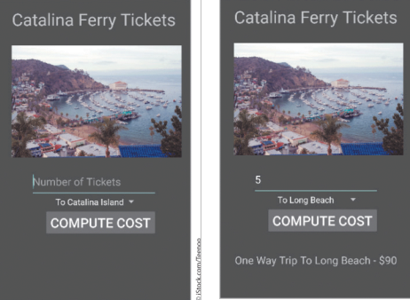

# Lab 5 Android User Input, Variables and Operations. Part 2

> You will need to download the following picture folder -> [Lab_5_Picture.zip](Lab_5_Pictures.zip)

For the exercises below, follow the steps in the Ticket Vault example (from last week lab).

## 1. Catalina Island Boat Express App

|Application Title|Catalina Island Boat Express App|
|---|---|
|Purpose|Catalina Express has 30 daily departures between Long Beach and Catalina Island. Create a simple app that determines how many boat tickets the user needs and whether the ticket is for going to Catalina Island or heading back to Long Beach. The app displays the total price for the fare in one direction|
|Algorithm 1:|The app displays a title; an image (provided in the Pictures folder at top of workbook), and a Text Field, Spinner, and Button control. The two options in the Spinner control include To Catalina Island and To Long Beach. Each single passenger ticket is $34 for one way.
|Algorithm 2:|When the user taps or clicks the Button control, the number of tickets and the total cost of the fare is displayed|
|Alogrithm 3:|Use a black theme, Spinner prompt, string array, and a hint property.|

---------

## 2. Triathlon Registration App

|Application Title|Triathlon Registration App|
|---|---|
|Purpose|A triathlon registration app allows an athlete to register for one of three national triathlons to qualify for the Ironman World Championship|
|Algorithm 1:|The triathlon registration app has two Text Fields: one requests the number of athletes on the user’s team and the other requests the location. A Spinner control allows the athlete to select one of three possible locations: Lake Placid, Big Island Hawaii, and Miami. The app also displays a title, an image (called triathlon.png in the Pictures folder you downloaded) and a Button control.|
|Algorithm 2:|After the user clicks the Button control, the selected location and the total team coast are displayed in the TextView control.|
|Algorithm 3:|Use a theme, a title, an image, a Spinner prompt, a string array, and a hint property|

-----

## 3. Medway Cab Fare App

|Application Title|Medway Cab Fare App|
|---|---|
|Purpose|Create an app that estimates the cost for cab fare in Medway. The app calculates the cost of the trip and request a reservation for a smart car, traditional sedan or a minivan|
|Algorithm 1:|The app requests the distance in miles for the cab ride and your preference for the requested cab: a smart car, traditional sedan or a minivan.  The cab fare has an initial fee of £3.00. The mileage rate of £3.50 is also charged.|
|Algorithm 2:|The app displays the name of a cab company (do your own research what kind of cab companies are available in Medway and choose one), a picture of a logo, and the results of the requested type of cab with the cost of the fare. Create your own layout.|
|Algorithm 3:|Use a theme, Spinner prompt, string array, and hint property.  Decimal mileage is possible.|

------

## 4. Split the Bill App

|Application Title|Split the Bill App|
|---|---|
|Purpose|You are out with friends at a nice restaurant.  This app splits the bill, including the tip, among the members of your party.|
|Algorithm 1:|A welcome screen displays the title, image, and button that displays a second screen when clicked. The input/output screen requests the restaurant bill and the number of people in your group. The Spinner control asks about the quality of service: Excellent, Average or Poor.|
|Algorithm 2:|Calculate a 15% tip and divide the restaurant bill with the tip included among the members of your party. Display the tip amount and the individual share of the bill.|
|Algorithm 3:|Use a theme, Spinner prompt, string array, and hint property.|