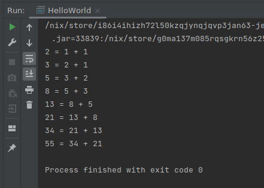

# One Dimensional Arrays (Intellij)

Using IntelliJ you are going to do some one dimensional array coding and exploration. 

 - Open IntelliJ 
 - Create a new project
   - Call it `HelloWorld` like the screen shot below.
   - Note you can use any JDK for this exercise, I am using JDK 11.0.13t


- Once this has been done, select the `src` and right click to create a new `package`
- call the package `example.com.helloworld`


## Hello World Goodbye World.

Open the java class file name `HelloWorld`, and reproduce the following code: 

```java
package example.com.helloworld;

public class HelloWorld {
    public static void main(String[] args)
    {
        System.out.println("Hello World!");
        System.out.println("Goodbye World!");
    }
}
```

To run it, you can click the green arrow on line 3 of the editor. 


You should see the following output on below the code...


## Arrays.

Remove the everything from inside the `public static void main(){...}` function and lets declare and interger array allocated enough memory for 10 integers to store the first 10 digits of the Fibonacci sequence.


```java
int[] fibonacciArray = new int[10];

```

For reference, the Fibonacci sequence is the sequence of numbers F(0), F(1)... defined by the following recurrence relations:

\\(F(O) = 1,F(1)=1,F(n) =F(n-1)+F(n-2)\ for\ all\ n > 1.\\)

or... 

\\[ F(n) = \frac{\frac{1+\sqrt{5}^n}{2}-\frac{1-\sqrt{5}^n}{2}}{\sqrt{5}}\\]

which becomes...

\\[ F(n) = \frac{\phi^n - (1-\phi^n)}{\sqrt{5}}\\]

where:
- \\(\phi\\) is the golden ration (1.618)
- \\(n\\) is the position number of the term in the sequence
- \\(F(n)\\) is the term in the sequence you are trying to find.

Finally, this translates as...

\\[F(n) = F_{n-1}+F_{n-2}\\]

Reproduce the following code,

```java 
int[] fibonacciArray = new int[10];

fibonacciArray[0] = 1; // assign element 0, with the value 1
fibonacciArray[1] = 1; //  assign element 1, with the value 1

// create a for loop that will iterate over the lenght of the array and compute the next 8 position in the sequence
for(int i =2; i < fibonacciArray.length; i++)
{
    //F(n) = F_n-1 + F_n-2
    fibonacciArray[i] = fibonacciArray[i - 1] + fibonacciArray[i - 2];
    // show sequence as array is populated
    System.out.println(fibonacciArray[i]+" = "+ fibonacciArray[i - 1] + " + "+fibonacciArray[i - 2]);
}
```

Run the code and you should see the following output... 



Modifiy this code to get the 45th number in the sequence

<details>

<summary>Suggested Answer</summary>

```java
int[] fibonacciArray = new int[45];

fibonacciArray[0] = 1; // assign element 0, with the value 1
fibonacciArray[1] = 1; //  assign element 1, with the value 1

// create a for loop that will iterate over the lenght of the array and compute the next 8 position in the sequence
for(int i =2; i < fibonacciArray.length; i++)
{
    //F(n) = F_n-1 + F_n-2
    fibonacciArray[i] = fibonacciArray[i - 1] + fibonacciArray[i - 2];
    // show sequence as array is populated
    System.out.println(fibonacciArray[i]+" = "+ fibonacciArray[i - 1] + " + "+fibonacciArray[i - 2]);
}

```

</details>

What happens when you print the 46th number in the sequence? Give it ago.


Reproduce the following code: 

```java
public static void main(String[] args)
    {
       String[] pangram = {"quick","over","dog","jumps","brown","The","lazy","fox","the"};

       System.out.println(pangram[1]);
    }
```

Try to use indexing to produce the correctly ordered pangram on the same line.

"The quick brown fox jumps over the lazy dog"