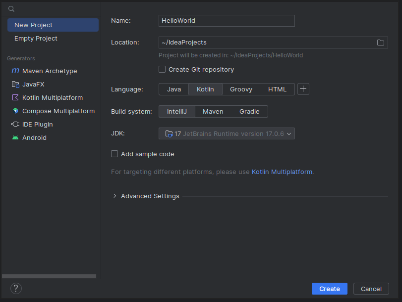
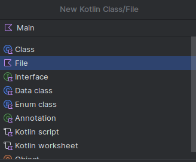
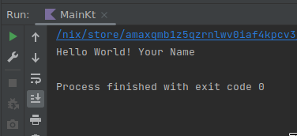
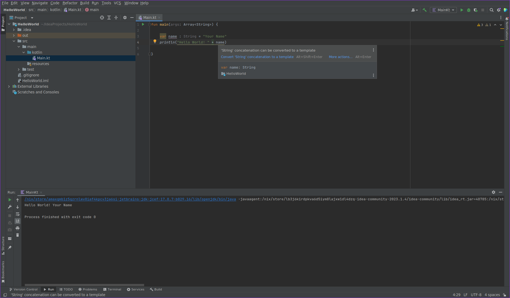
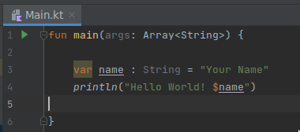
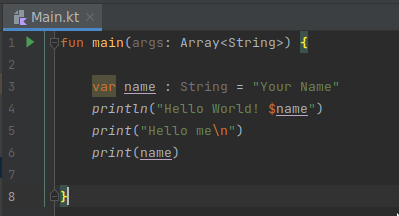
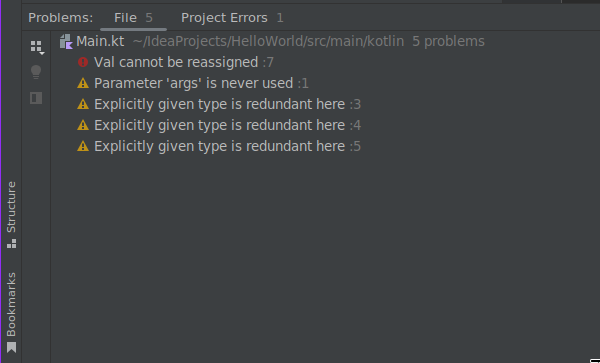

# Lab 1: Introduction to Kotlin

> **Important**
>> - You will be using IntelliJ IDE
>> - From your Start Menu type 'IntelliJ' and select run!
>> - If you want to run this on your own machine you can download the community Edition from here -> [https://www.jetbrains.com/idea/download/?section=windows](https://www.jetbrains.com/idea/download/?section=windows)

-----------------------

## 1. Getting Started 

1. Once opened you will be greeted witht he landning page: 
    

2. Select **New Project**
   1. Modify the *Name* to **HelloWorld**
   2. Change Language to **Kotlin**
   3. Uncheck **Add sample code**
   4. Click **Create**
   
        

3. Once loaded (can take a few minutes) you will see the following project structure:

<div style="width: 60%; margin: 0px auto;">
    
 
</div>

4. Adding a Kotlin Class file
   1. Right click the highlighted Kotlin folder in previous image
   2. Once the context menu opens click 'New' and then Kotlin Class/file
5. Create a new **File** file called `Main`
   
<div style="width: 60%; margin: 0px auto;">


</div>

6. Now we can populate our new `Main.kt` file with some code.
   > **NOTE** `.kt` is the extension for Kotlin files
   1. Write the following: 
   
    ```kt
    fun main(args: Array<String>) {
        
        println("Hello World!")
    
    }   
    ```
    2. `fun` is a **hard keyword** that tells the Kotlin you are declaring a function.
    3. `main()` is the function name, and any console based program like this, `main()`, is the entry point of the program when it is exectued by the OS.
    4. `(args: Array<String>)`, is the way of telling the program that it can take in arugments supplied to it, in this instance `args`, the variable, will be an `Array` of `Strings` 
    5. Everything between the `{}` braces is excuted by the program. 
    6. Lastly, `println("Hello World!")`, calls the function `println()` which prints whatever is in the brackets to the terminal with a `\n` new line at the end henece the `ln` in `println`.
    7. Now you can run the program using the either of the green arrows:
   
    <div class="column" style="display: flex;">

    <div style="flex: 50%;">

    
    </div>

    <div style="flex: 50%;">

    
    </div>
    </div>

    8. You should see a terminal appear about the bottom of the IDE that shows some output. 
   <div style="width:100%; margin: 0px auto;">
   
   

   </div>

7. Now you are going to modify the programme so that `printl()` to take a variable
   1. Create a mutable variable called `name`
      ```kt
      fun main(args: Array<String>) {
        
        var name : String = "Your Name"

        println("Hello World! " + name)
    
      }  
      ```
8. Run and you should see the following output
   <div style="width:60%; margin: 0px auto;">
   
   

   </div>
9. Notice the green underwave underneath the `println("Hello World! " + name)`
   <div style="width:60%; margin: 0px auto;">
   
   

   </div>

  > **Note: Code Inspections**
  >> 
  >> - Green = typo, literals, weak warnings
  >> - Red = Error (will not compile)
  >>
  >> You can find more if you go to File>Settings>Editor>Color Scheme > General > Errors and Warnings

1.  This underwave can be corrected two ways, either hover over and follow the quick key short cut '<kbd>Alt</kbd>+<kbd>Shift</kbd>+<kbd>Enter</kbd>'. Or Manually fix it by reproducing the output below.
     
   <div style="width:100%; margin: 0px auto;">
   
   

   </div>

2.  You will see the that `println("Hello World! " + name)` has been refactored to:

   <div style="width:45%; margin: 0px auto;">

   

   </div>

   >**Notes**
   >> - String literals may contain **template expressions** – pieces of code that are evaluated and whose results are concatenated into the string. 
   >> - A template expression starts with a dollar sign `$` and consists of either a name
   >> - or an expression in curly braces:

   ```kt
   val s = "Hello World"
   println("$s.length is ${s.length}") // Prints "Hello World.length is 11"
   ```
12. Run the program again, do you get the same ouput? 


13. Modify further with `print()` function

<div style="width:45%; margin: 0px auto;">



</div>

>**Note:**
>> - `print()` by default does not terminate with a  new line (`\n`) line character, unlike `println()`
>> - however, you can tell it to, by adding a `\n` to the end of the message inbetweent the two brackets.

13. Run it and see for yourself, then remove the `\n` from the end of `print("Hello me\n)`, is it the same?

-------------

## 2 Mutable and immutable

1. `var` is like general variable and it's known as a **mutable** variable in kotlin and can be assigned multiple times.


2. `val` is like final variable and it's known as **immutable** in kotlin and can be initialised only a single time.

>>**Note**
>> - The term mutable comes from mutation, as is to mutate, to change. In computing this means **Read** & **Write** 
>> - Therefore immutable is something that can not mutate nor change. In comupting this means **Read only**

3. Since you started we have been using `var` to define the variable `name`, this is technically incorrect, because we never change the value after declaration.
4. Let's change this to `val` to make our code more **clean**.
5. Reproduce the following:
```kt
fun main(args: Array<String>) {

    val a: Int = 4
    val b: Int = 4
    var c: Int = 0

    print("$c = $a + $b")

}
```
 1. Before running to code, predict what the outcome will be? Now run it, does it match your prediction?
      
      <details>
      <summary>Answer</summary>

      `0 = 4 + 4`
      
      - This is because no mathemcatical operation is performed inside a String concatenation
      </details>
   
 2. Modify the above code so that it looks like this:
   ```kt
   fun main(args: Array<String>) {

      val a: Int = 4
      val b: Int = 4
      var c: Int = 0

      c = a + b

      print("$c = $a + $b")i
   }
   ```


 3. Before running to code, predict what the outcome will be? Now run it, does it match your prediction?

      <details>
      <summary>Answer</summary>

      `8 = 4 + 4`
      
      - This is because the mathemcatical operation is performed outside a String concatenation, and the result of `a + b` is saved to `c`
      </details>

4. Now let's change the how `c` is declared, modify `c` so that `var` is now `val`:
   ```kt
   val c: Int = 0
   ```
5. Before running to code, predict what the outcome will be? Now run it, does it match your prediction?

      <details>
      <summary>Answer</summary>

      - You can't, notice the red underwave, this is an error, because `c` is **immutable** now. 
      - it is important to read the **Problems** tab at the bottom of the IDE.
      
      - Change it back to `var`.
      - We are not going to worry about the warnings for now, will come back to that later.

      </details>

## 3. Data types

1. Remember from the lecture that data types are as follows: 

- **Numbers** (six built-in types)
  - Byte [ \\(-127\\) to \\(128\\) ]
  - Short [ \\(-32768\\) to \\(32767\\) ]
  - Int [ \\(-2^{31}\\) to \\(2^{31}-1\\) ]
  - Long [ \\(-2^{63}\\) to \\(2^{63}-1\\) ]
  - Float [ \\(2^{32}\\) ]
  - Double [ \\(2^{64}\\) ] 
- **Characters**
  - Chars [ \\(2^{16}\\) ]
    - because unicode instead of just ASCII
    - `\u0000`,`\uFFFF`
- **Booleans**
  - true
  - false
  - All though 1 bit (1,0), it is technically a Byte due.
- **Arrays**
  - get
  - set
  - size
  - length
  - etc...
- **Strings**
  - A class, not techincally a data type

2. Lets check the maximum and miniumum values avaialable to you on your machine or VM
   1. Start your program off as follows and run: 

      ```kt
      fun main(args: Array<String>) {

         val b1: Byte = Byte.MIN_VALUE
         val b2: Byte = Byte.MAX_VALUE
         println("Smallest signed byte value: " +b1)
         println("Largest signed byte value: " +b2)

         val ub1: UByte = UByte.MIN_VALUE
         val ub2: UByte = UByte.MAX_VALUE
         println("Smallest unsigned byte value: " +ub1)
         println("Largest unsigned byte value: " +ub2)

         println("--------------------------------------------------")
      }

      ```
      <details>
      <summary>Output</summary>

      <div style="width:60%; margin: 0px auto;">

      

      </div>

      </details> 

   2. Now repeat for each data type, remembering to inculde signed and unsigned variants:
      - `Short`
      - `Char`
      - `Int`
      - `Long`
      - `Float`
      - `Double`

      > **Notes**
      >> - `Char` will need to be cast as an `Int` 
      >> - `Float` and `Double` can only be signed
      >> - eg.
      >> `val someVal: dataTypeYouWant = originalDataType`
      
         <details>
         <summary>Whole code, do it yourself first</summary>
         
         ```kt
         fun main(args: Array<String>) {

            val b1: Byte = Byte.MIN_VALUE
            val b2: Byte = Byte.MAX_VALUE
            println("Smallest signed byte value: " +b1)
            println("Largest signed byte value: " +b2)

            val ub1: UByte = UByte.MIN_VALUE
            val ub2: UByte = UByte.MAX_VALUE
            println("Smallest unsigned byte value: " +ub1)
            println("Largest unsigned byte value: " +ub2)

            println("--------------------------------------------------")

            val s1: Short = Short.MIN_VALUE
            val s2: Short = Short.MAX_VALUE
            println("Smallest signed short value: " +s1)
            println("Largest signed short value: " +s2)

            val us1: UShort = UShort.MIN_VALUE
            val us2: UShort = UShort.MAX_VALUE
            println("Smallest unsigned short value: " +us1)
            println("Largest unsigned short value: " +us2)

            println("--------------------------------------------------")

            val c1: Int = Char.MIN_VALUE.code
            val c2: Int = Char.MAX_VALUE.code
            println("Smallest Char value: " + c1)
            println("Largest Char value: " + c2)

            println("--------------------------------------------------")

            val i1: Int = Int.MIN_VALUE
            val i2: Int = Int.MAX_VALUE
            println("Smallest signed integer value: " +i1)
            println("Largest signed integer value: " +i2)

            val ui1: UInt = UInt.MIN_VALUE
            val ui2: UInt = UInt.MAX_VALUE
            println("Smallest unsigned integer value: " +ui1)
            println("Largest unsigned integer value: " +ui2)

            println("--------------------------------------------------")

            val l1: Long = Long.MIN_VALUE
            val l2: Long = Long.MAX_VALUE
            println("Smallest signed long integer value: " +l1)
            println("Largest signed long integer value: " +l2)

            val ul1: ULong = ULong.MIN_VALUE
            val ul2: ULong = ULong.MAX_VALUE
            println("Smallest unsigned long integer value: " +ul1)
            println("Largest unsigned long integer value: " +ul2)

            println("--------------------------------------------------")

            val F1: Float = Float.MIN_VALUE
            val F2: Float = Float.MAX_VALUE
            println("Smallest Float value: " +F1)
            println("Largest Float value: " + F2)

            val D1: Double = Double.MIN_VALUE
            val D2: Double = Double.MAX_VALUE
            println("Smallest Double value: " + D1)
            println("Largest Double value: " + D2)
            }
      ```
      </details>

      3. When done, you should get the same output as below:
      
         <details>
         <summary>Output</summary>

            ```
            Smallest signed byte value: -128
            Largest signed byte value: 127
            Smallest unsigned byte value: 0
            Largest unsigned byte value: 255
            --------------------------------------------------
            Smallest signed short value: -32768
            Largest signed short value: 32767
            Smallest unsigned short value: 0
            Largest unsigned short value: 65535
            --------------------------------------------------
            Smallest Char value: 0
            Largest Char value: 65535
            --------------------------------------------------
            Smallest signed integer value: -2147483648
            Largest signed integer value: 2147483647
            Smallest unsigned integer value: 0
            Largest unsigned integer value: 4294967295
            --------------------------------------------------
            Smallest signed long integer value: -9223372036854775808
            Largest signed long integer value: 9223372036854775807
            Smallest unsigned long integer value: 0
            Largest unsigned long integer value: 18446744073709551615
            --------------------------------------------------
            Smallest Float value: 1.4E-45
            Largest Float value: 3.4028235E38
            Smallest Double value: 4.9E-324
            Largest Double value: 1.7976931348623157E308

            Process finished with exit code 0

            ```

         </details>

3. **Arrays**
   - You can have an array of any data type 
   - They are stored in contiguous memory locations.
   - They can be accessed programmatically through their indexes (array[1], array[0], etc.)
   - They are mutable (`val`).
   - Their size is fixed.

   >**Notes:**
   >> 
   >> -  `val num = arrayOf(1, 2, 3, 4)   //implicit type declaration`
   >>
   >> - `val num = arrayOf<Int>(1, 2, 3) //explicit type declaration`
   >>
   >> -  `val sentence = String: "This is a sentence." // Strings are an array of characters`


   Reproduce the following to experiment with the various iterations of array manipulation:

   ```kt
   1 var sentence :String = "This is a sentence"
   2 
   3 for (i in 0 ..< sentence.length)
   4 {
   5   print(" "+sentence[i])
   6 }
   ```

   The `for` is a keyword that enables the iteration through anything that provides an iterator. Here the iterator is the `i` a variable that iterates through a supplied list, collection, enumerable or objects.

   >**Note**
   >> -  A reminder that a `String` is a sequence or an array of characters.

   After the opening bracket `( i` the next keyword is `in` and is consider an *operator*, here `in` is to used to iterate over the the length of `sentence` excuting the `print(..)` method, until `i` is less than, `<`, the length.

   The output should look something like:

   ```kt
   T h i s  a  s e n t e n e c e
   ```

   Notice the white spacing between each letter and the extra white space between the words.

   Another way to write the for loop:

   ```kt
   1 var sentence :String = "This is a sentence"
   2 
   3 for (element in sentence)
   4 {
   5   print(" "+ element)
   6 }
   ```

   A slight difference here is that instead of iterating using an iterator with an integer to the a specified length we iterate over all elements of the object or list. The use of the the word `element` is not reserved, and you could replace this with anything that makes sense, as long as it is not another keyword:

   ```kt
   1 var sentence :String = "This is a sentence"
   2 
   3 for (characters in sentence)
   4 {
   5   print(" "+ characters)
   6 }
   ```


   Run this code either way and you should still recieve the same output as before: 

   ```kt
   T h i s  a  s e n t e n e c e
   ```

   An array can be defined, explicitly or implictly by doing the following:

   ```kt
   // declaring an array using arrayOf<Int> this is explicit
   val explicitArray = arrayOf<Int>(10, 20, 30, 40, 50)
   val implicitArray = arrayOf(10, 20, 30, 40, 50)
   ```

   Another way to iterate over the array is to do the following: 

   ```kt
   for (i in 0.rangeTo(explicitArray.size-1))
   {
      print(" "+explicitArray[i])
   }
   ```

   <details>
   <summary>Notice anything different to before? </summary>

   - `0.rangeTo(...)`
   - This is technically an operator function, where the preceeding number `0`  can be any number less than the range provided in the arguments to the function.
   - `explicitArray.size`, where `size` is a attribute of the array, much like `length` was to `sentence` earlier. We minus 1 from the size because arrays are 0 indexed. Meaning that while there are 5 indices in the `explicitArray` it starts at at index 0 and goes to 4, which is a total of 5. 
   - modifiy the code and run it again to see why we need to subtract 1.
   - ```kt
      for (i in 0.rangeTo(explicitArray.size))
      {
         print(" "+explicitArray[i])
      }
      ```
   </details>

4. ## Conditionals

 1. We are going to make a series of if statements to verify login details. 

   Reproduce the following: 

   ```kt
   fun main() {
      
      var showAccountPage : Boolean = false
      var user : Boolean = false
      var password : Boolean = false

      val userName : String = "AUsername"
      val userPassword: String = "1c4n234d13375p34k!" // if you know, you know...

      var inputtedUserName : String? = ""
      var inputtedPassword : String? = ""

      println("Username: ")
      inputtedUserName = readlnOrNull()
      println("Password: ")
      inputtedPassword = readlnOrNull()

      if (userName == inputtedUserName )
      {
         user = true
         if(userPassword == inputtedPassword){
               password = true
               if (user == true && password == true)
               {
                  showAccountPage = true
                  print("Successfully logged in")
               }
         }
         else{
               print("Password does not match: $inputtedPassword")
         }
      }
      else{
         print("Username does not match: $inputtedUserName")
      }
   }
   ```

   Breaking the code down:

   - **Booleans**

      - `showAccountPage`: A `Boolean` variable indicating whether the account page should be displayed. It is set to `true` only if both username and password match the predefined values.
      - `user`: A `Boolean` variable indicating whether the inputted username matches the predefined username. It is set to `true` if the usernames match.
      - `password`: A `Boolean` variable indicating whether the inputted password matches the predefined password. It is set to `true` if the passwords match.

   - **Strings**
      - `userName`: A predefined `String` containing the correct username.
      - `userPassword`: A predefined `String` containing the correct password.

   - **Inputs**
      - `inputtedUserName`: A `String` variable to store the username input by the user.
      - `inputtedPassword`: A `String` variable to store the password input by the user.
      Note that both of these are *nullable*, `?`, meaning that if not `String` is supplied it is not going to crash

   - **Nested `if`**
      - While the code will work as intended, readbility is the issue, we have a **three** deep `if`. 
         -  Username is checked, if match, then password, if match, then account page. 

   Run the code and try to login using the correct and incorrect credientials. 

2. Let's refactor the code and reduce the number of nested `if`s:


   ```kt
   fun main() {

      var showAccountPage = false
      var user = false
      var password = false

      val userName = "AUsername"
      val userPassword = "1c4n234d13375p34k!" // if you know, you know...

      println("Username: ")
      val inputtedUserName = readlnOrNull()
      println("Password: ")
      val inputtedPassword = readlnOrNull()

      if (userName == inputtedUserName) {
         user = true
      }

      if (userPassword == inputtedPassword) {
         password = true
      }

      if (user && password) {
         showAccountPage = true
         println("Successfully logged in")
      }
      else {
         println("Username and or Password does not match")
         exitProcess(1)
      }
   }
   ```

   Note how the we only check to see if the credential is `true`, and if they both are we can login, else it does not. We have gone from 32 lines to 27, is there a way to  refactor further?