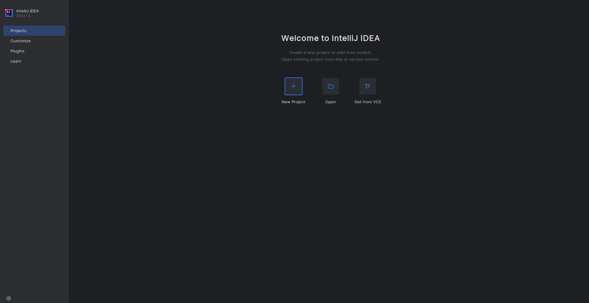
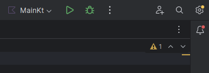

# Lab 1: Introduction to Kotlin

> **Important**
>> - You will be using IntelliJ IDE
>> - From your Start Menu type 'IntelliJ' and select run!
>> - If you want to run this on your own machine you can download the community Edition from here -> [https://www.jetbrains.com/idea/download/?section=windows](https://www.jetbrains.com/idea/download/?section=windows)

-----------------------

## 1. Getting Started 

1. Once opened you will be greeted witht he landning page: 
    

2. Select **New Project**
   1. Modify the *Name* to **HelloWorld**
   2. Change Language to **Kotlin**
   3. Uncheck **Add sample code**
   4. Click **Create**
   
        

3. Once loaded (can take a few minutes) you will see the following project structure:

<div style="width: 60%; margin: 0px auto;">
    
 
</div>

4. Adding a Kotlin Class file
   1. Right click the highlighted Kotlin folder in previous image
   2. Once the context menu opens click 'New' and then Kotlin Class/file
5. Create a new **File** file called `Main`
   
<div style="width: 60%; margin: 0px auto;">


</div>

6. Now we can populate our new `Main.kt` file with some code.
   > **NOTE** `.kt` is the extension for Kotlin files
   1. Write the following: 
   
    ```kt=
    fun main(args: Array<String>) {
        
        println("Hello World!")
    
    }   
    ```
    2. `fun` is a **hard keyword** that tells the Kotlin you are declaring a function.
    3. `main()` is the function name, and any console based program like this, `main()`, is the entry point of the program when it is exectued by the OS.
    4. `(args: Array<String>)`, is the way of telling the program that it can take in arugments supplied to it, in this instance `args`, the variable, will be an `Array` of `Strings` 
    5. Everything between the `{}` braces is excuted by the program. 
    6. Lastly, `println("Hello World!")`, calls the function `println()` which prints whatever is in the brackets to the terminal with a `\n` new line at the end henece the `ln` in `println`.
    7. Now you can run the program using the either of the green arrows:
   
    <div class="column" style="display: flex;">

    <div style="flex: 50%;">

    
    </div>

    <div style="flex: 50%;">

    
    </div>
    </div>

    8. You should see a terminal appear about the bottom of the IDE that shows some output. 
   <div style="width:100%; margin: 0px auto;">
   
   

   </div>

7. Now you are going to modify the programme so that `printl()` to take a variable
   1. Create a immutable variable called `name`
      ```kt
      fun main(args: Array<String>) {
        
        var name : String = "Your Name"

        println("Hello World! " + name)
    
      }  
      ``` 