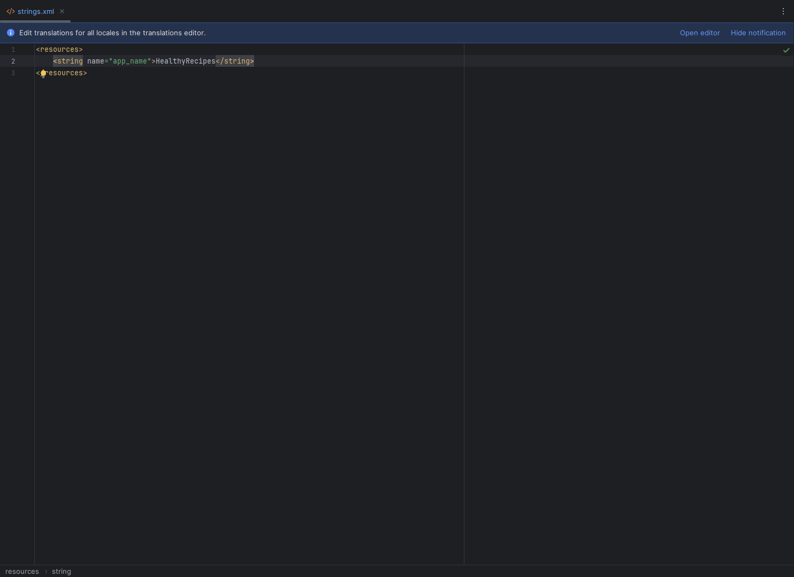
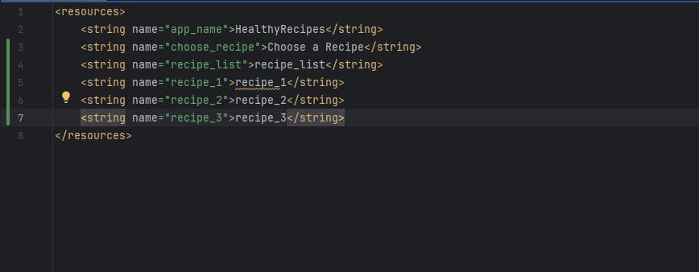

# Lab 3 Android User Interface. Part 1

Do the example from the lecture following the guidelines below.

## Using the Android User Interface

Download images for the lab from here [pictures_lab_3.zip](./pictures_lab_2.zip)
### Step 1

• Start a new project.  Open Android Studio.  Select File/New/New Project... from the main menu. Make sure the language selected is `Kotlin`.

• On the window that appears just click the Next button, making sure the Empty Views Activity is chosen (it is by default!).


### Step 2:
• After clicking the next button, the Create New Project dialog appears.

• In the Name: text box, type in Healthy Recipes. 7

• Choose the location where you want to save your projects or just use the default suggested location if =you are happy with it.

• Make sure the language chosen is Kotlin and NOT Java!

• If necessary, select API16: Android 4.1 (Jelly Bean) for the Minimum SDK as shown below:


### Step 3:
• Click the Finish button. 

• The Android project is now created and the `activity_main.xml` file and `MainActivity.kt` file are visible as tabs. 

### Step 4:

• Click on the `activity_main.xml` tab

• Click the Hello world! TextView widget (displayed by default) in the emulator and press the Delete key. 

## Using the String Table in the Transitions Editor

### Step 1:

• In the Android project view, expand the values folder within the res folder.

• Double-click the strings.xml file to display its default string resources



### Step 2:

• Click the Open editor link.

• Click the Add Key (+) button in the Translations Editor.

• In the Key text box, type `txtTitle` to name the string for the TextView control.

• In the Default Value text box, type `Bruschetta Recipe` to define the text to display.


### Step 3:

• Click the OK button.

• Click the Add key (+) button in the Translations Editor.

• In the Key text box, type btnRecipe to name the string for the Button control.

• In the Default Value text box, type View Recipe to define the text.

• Click the OK button.

• Click the Add key (+) button in the Translations Editor.

• In the Key text box, type description to name the string for the Button control.

• In the Default Value text box, type Recipe Image to define the text.
 
### Step 4:

• Click the OK button to add the string for the Button control to the String table, and then click the Add Key (plus sign) button in the Translations Editor.

• In the Key text box, type txtIngredients to name the string for a TextView control to display on the second app screen.

• In the Default Value text box, type Ingredients to define the text, and then click the OK button to add the string to the String table.

• Using the techniques taught in this step, add the strings in the table below to the String table in the Translations Editor:

|Key|Default Value|
|---|----|
|hello| Hello Seb!|
|btnRecipe|View Recipe|
|description|Recipe Image|
|txtItem1| 4 plum tomatoes|
|txtItem2| 6 basil leaves|
|txtItem3| 3 garlic cloves, chopped|
|txtItem4| 3 TB olive oil |
|txtDirections| Directions|
|txtIngredients| Ingredients|
|txtMix| Combine the ingredients and add salt to taste. Top French bread slices with mixture.|



## Android Text Properties

### Step 1:

• In the Common category in the Palette, select the widget named `TextView` and drag it near the top of the emulator.

• To centre the `TextView` control, drag it to the centre of the emulator until a dashed vertical line identifying the window’s centre is displayed.

### Step 2:

• Click on the TextView control on the emulator.

• Click on the vertical bar next to the text Property of the `textView` in the Attributes window.


• Type into the the Text field that has the value Text View

• Replace with the following `@string/txtTitle`, which references the string.xml file in the resource folder and accesses the string named txtTitle.

<div style="positon: absolute">


</div>

**Step 2:**

• Click on the textView and then take the anchor points on the top bottom left and right, looks like a filled 'O', and drag the lines to edge of the white area, you are aiming for the below image. 


• In the Attributes pane, choose the maginfiying glass and type in text. Find the textSize property from the list of text properties that appears. Like the image above.

• Click to the right of the textSize property (highlighted in blue), type `40sp`, and the press Enter.

• Select the Hello World TextView and delete it.

• The result is shown below:


## Adding a File to the Resources Folder

**Step 1:**

• From the downloaded pictures copy the bruschetta.png 

• To paste the image file into the drawable folder, right click the drawable folder in the Android project view.

• Click the "Show In Resources Manager"

• Click the plus `+` in the top left hand corner of the new window

• Select the picture you want using the file explorer that popped up.


## Adding an ImageView Control

**Step 1:**

• Click ImageView in the Common category in the Palette on the Design tab and drag it to the centre of the emulator until a dashed vertical line appears, indicating the control is centred.  

• A Resources pane will appear, choose the bruschetta image.

• Press the Ok button.


**Step 2:**

• In the Attributes pane find the contentDescription property.

• Click the vertical bar next to it. 

• In the Pick a Resource Pane choose description and then press Enter.


## Adding a Button Control

**Step 1:**

• From the Common category in the Palette, drag the Button control to the emulator below the ImageView control until a dashed vertical line appears, indicating the control is centred.  Release the mouse button.

• Click the button and in the Attributes pane, click on the vertical line next to the text attribute.

• In the Pick a Resource Pane which appears, btnRecipe and then press Enter.

• In the Attributes pane, choose the  and type in text. Find the textSize property from the list of text properties that appears.

• Click to the right of the textSize property, type 36sp, and the press Enter.

• Now press the Infer Constraints button as shown below in order to automatically create constraints.  If constraints are not present, all the controls will appear at the top of the emulator. 

Now run the emulator to see how the layout will look like.  In order to do that click the Run ‘app’ green arrow below the main menu or press Shift +F10.  


The result is shown below:


## Adding a New Class File

**Step 1:**

• Close the activity_main.xml tab.

• In the Android project view, expand the java folder and the first package to view the MainActivity Java class.

• To create a second class, press and hold or right click the first folder, click New and the shortcut menu , and then click Activity,

**Step 2:**

• Click Empty  Views Activity to create a second Activity class.

• In the Activity Name text box, type Recipe to create a second class.


**Step 3:**

• Click the Finish button to finish creating the Recipe class and XML layout for the second screen.

• Delete the default Hello world! Text object from the activity_recipe.xml emulator.

• Using the techniques described earlier, create the second user interface, `activity_recipe.xml`, as shown below with multiple TextView controls.


• Ingredients and Direction headings have a textSize of 30sp.

• Ingredients and Direction content have a textSize of 25sp.

• Do not forget after you have finished developing the user interface, to Infer Constraints using the button on the top of the emulator screen.   Otherwise, all the text will appear at the top of the emulator, and it will overlap!

• The result is shown below:


## Coding a Button Event Handler

The `MainActivity.kt` class was created automatically by Android Studio.

**Step 1:**

• Click the `MainActivity.kt` tab to open its code window.

• To initialize and reference the Button control, type: ` val button Button = findViewbyId(R.id.button)` as seen under the `setContentView(R.layout.activity_main)` in the code block below.

• To initialize and reference the Button control, type: ` val button Button = findViewbyId(R.id.button)` as seen under the `setContentView(R.layout.activity_main)` in the code snippet below.


```kt
1 package com.example.healthyrecipes
2
3 import android.content.Intent
4 import androidx.appcompat.app.AppCompatActivity
5 import android.os.Bundle
6 import android.widget.Button
7
8 class MainActivity : AppCompatActivity() {
9    override fun onCreate(savedInstanceState: Bundle?) {
10      super.onCreate(savedInstanceState)
11      setContentView(R.layout.activity_main)
12
13      val button : Button = findViewById(R.id.button)
14
```

**Step 2:**
    
• To code the button listener that awaits user interaction, type `button.setOn` to display an auto-complete listing with all the possible entries that are valid at that point in the code. 

• Double click the first `setOnClickListener{}` to select it from the auto-complete listing.

• Inside the method add the functionality to launch the Recipe activity by inialising an `Intent`. An `Intent` is like a promise. Add the following line `val intent = Intent(this, Recipe::class.java)`

• Lastly, add the function `startActivity(Intent)`, this will load the Recipe activity once teh button has been clicked.

```kt
15      button.setOnClickListener {
16         val intent = Intent(this, Recipe::class.java)
17         // start your next activity
18         startActivity(intent)
19      }
20   }
21 }
```

- Run the app and test it.


**Step 3:**

- If this works as intended, can you add a button to the recipe page to take you back to the main activity? 