# Lab 4: Concert Ticket App

<div align=center>

<table>
<tr>
<td style="width: 50%; padding: 10px; border: 0px solid #ddd;">
You will be developing concert ticket app that lets you select predifined bands and check the cost of each ticket.  The Concert Ticket App is demoed right:

> - You will need to download the following picture folder -> [Lab_4_Picture.zip](Lab_4_Pictures.zip)
> - The completed project can be found here at end of session -> [https://github.com/UniOfGreenwich/MobileApps-ConcertTickets](https://github.com/UniOfGreenwich/MobileApps-ConcertTickets)

</td>
<td style="width: 50%; padding: 10px; border: 0px solid #ddd;">


</td>
</tr>
</table>

</div>

 ## Colours used:

 - <p style="background-color:#1E2C41;color:#ffffff">0XFF1E2C41</p>
 - <p style="background-color:#E3E3E6; color:#000000">0XFFE3E3E6</p>

----

## Setting Up the Project

### Video @ 1:13 - 4:40

1. **Create a New Project:**
    - Select "Empty Activity" and click "Next".
    - Name your application "Concert Tickets".
    - Ensure the package name is set to `com.uog.concerttickets`.
    - Set the minimum API level to 24.
    - Click "Finish" to create the project.


    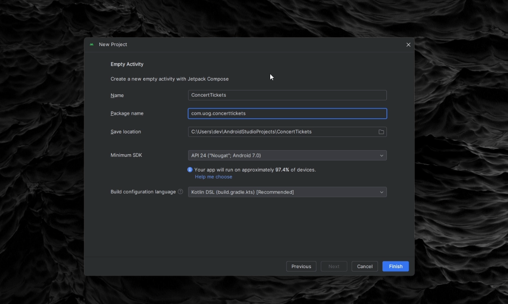
    
2. **Adding images and creating logo assest**

    - All the images are available in the Pictures folder downloaded in the zip.  Drag the files to the mipmap folder.
    - For the assest right clock the `concert_ticket_logo.png` and get the `absolute path` 
    - right click the res folder and add new image asset
    - In the Path: field paste the **Absolute File** path you copied earlier, and then select the file. 
    - Click the Next button to add the custom launcher icon. 
    - On the next dialog window, click the Finish button. The custom icons will be displayed in `res/mipmap` folder

        

---

## Modifying MainActivity

### Video @ 4.40 - 17.35

1. **Modify the Main Activity Layout:**
    - Open `MainActivity.kt`.
    - Reprodce this:

        ```kotlin
        package com.uog.concerttickets

        ... 

        class MainActivity : ComponentActivity() {
            override fun onCreate(savedInstanceState: Bundle?) {
                super.onCreate(savedInstanceState)
                enableEdgeToEdge()
                setContent {
                    ConcertTicketsTheme {
                        ConcertTicketApp()
                    }
                }
            }
        }

        @OptIn(ExperimentalMaterial3Api::class)
        @Composable
        fun ConcertTicketApp(){
            Scaffold(
                topBar = {
                    TopAppBar(
                        modifier = Modifier
                            .fillMaxWidth()
                            .height(50.dp),
                        title = { /* TODO */}
                    
                    )
                }
            ) { innerPadding ->
                Surface(modifier = Modifier.padding(innerPadding)) {
                    
                }
            }
        }

        @Preview(showBackground = true)
        @Composable
        fun GreetingPreview() {
            ConcertTicketsTheme {
                ConcertTicketApp()
            }
        }
        ``` 

    >**Notes on Composables Used:**
    >> - **Scaffold**: Provides a basic structure for the app’s layout, including slots for common UI components such as `TopAppBar`, `BottomAppBar`, `FloatingActionButton`, and `Drawer`.
    >>
    >> - **TopAppBar**: A composable that represents the top app bar, which usually contains the app title, navigation icons, and actions
    >>
    >> - **Modifier**: A flexible way to describe how a composable should be laid out, styled, or behave.
    >> 
    >> - **Surface**:  A composable that provides a background and other properties like elevation and shape, often used as a container for other composables
    >>
    >> - **@OptIn**: An annotation that indicates the usage of an experimental API
    >> 
    >> - **enableEdgeToEdge()**: This function is typically used to set up the app to render edge-to-edge, utilizing the full screen area
    >>
    
    - You can modify the  title element to hold an image and text: 

        ```
        title = {
            Row(
                verticalAlignment = Alignment.CenterVertically,
                modifier = Modifier.fillMaxWidth()
            ){
                Image(painter = painterResource(id = R.mipmap.concert_ticket_logo),
                    contentDescription = "App Logo",
                    modifier = Modifier.size(50.dp))

                Spacer(modifier = Modifier
                    .align(alignment = Alignment.CenterVertically)
                    .background(Color.White))

                Text(
                    text = stringResource(id = R.string.app_name), 
                    fontWeight = FontWeight.Bold,
                    color = Color(0XFF1E2C41))
            }
        }
        ```

    <div align="center">

    
    
    </div>

- Modify the string resoucre app_name so that there is a space between the `ConcertTickets` like so `Concert Tickets`

    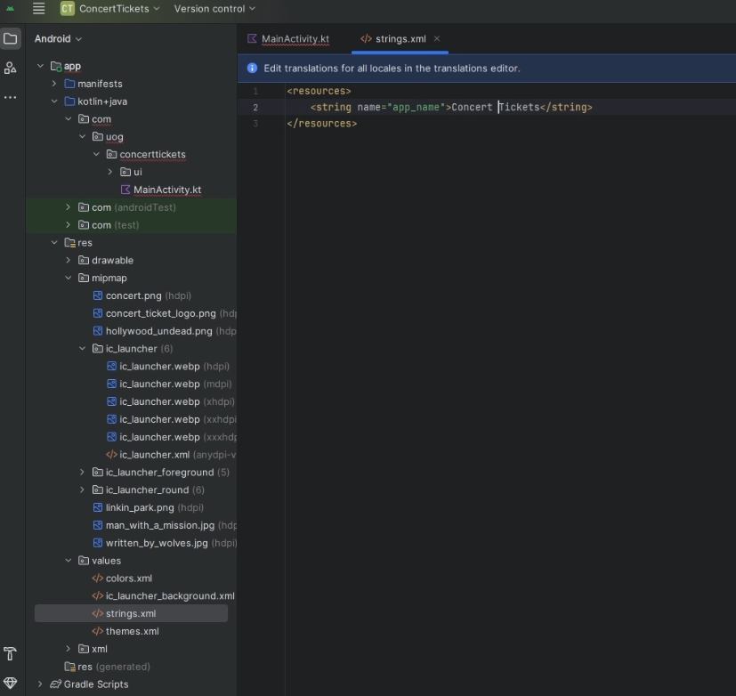

- We need to create several composables that will show the DropDownMenu, TextField, Text, Button and Image, reproduce the following, inside the `Surface` Composable add the following `Column`:

    ```kt
    ...
    ) { innerPadding ->
        Surface(modifier = Modifier.padding(innerPadding)) {
            Column(modifier = Modifier.fillMaxSize()) {
                // Band Selection
            }
        }
    ...

    ```

    >> **Notes on Composables Used:**
    >> - **Row**: Layout composable that arranges its children in a horizontal sequence.
    >>
    >> - **Image**: A composable for displaying images.
    >>
    >> - **Spacer**: A composable that creates an empty space in the layout
    >>
    >> - **Text**: A composable for displaying text.
    >>
    >> - **Column**: A layout composable that arranges its children in a vertical sequence

## BandSelection, Band and Band Data

### Video @ 17.35 - 44.10

- Underneath the ConcertTicketApp Composable create a new Composable that will handle our Band Selection, called `BandSelection(selectedBand : Band)`

    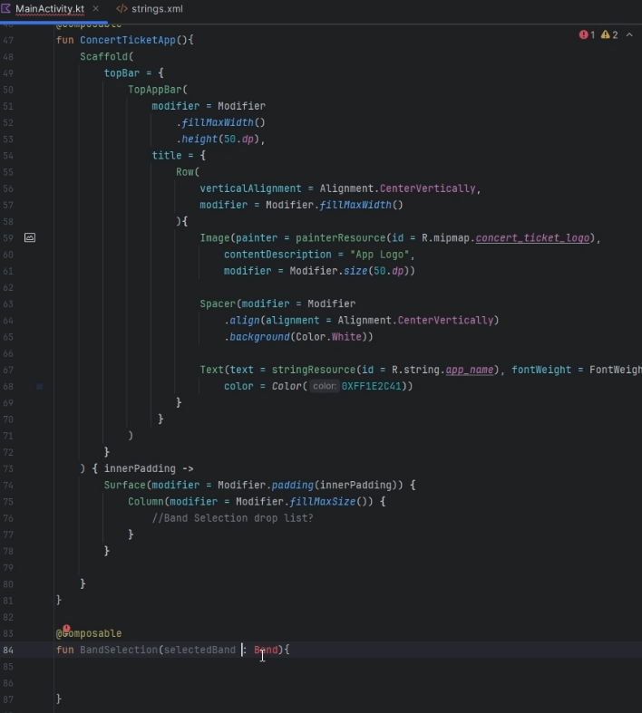

- Now we need to create the `Band` `data class`, navigate to the top of the file and  between the `import`'s and the `MainActivity` definition and create a `data Class Band()` with the following fields:

    ```kt
    data class Band(val name: String, val imageRes: Int, val price: Float)
    ```

- Next we need to add the `object BandDataSource` underneath the `data class` we just defined, that will hold the static band data:

    ```kt
    object BandDataSource {

        val bands = listOf(
            Band("Select a Band", R.mipmap.concert,0.0f),
            Band("Written By Wolves", R.mipmap.written_by_wolves,24.95f),
            Band("Linkin Park", R.mipmap.linkin_park,63.95f),
            Band("Man with a Mission", R.mipmap.man_with_a_mission,36.00f),
            Band("Hollywood Undead", R.mipmap.hollywood_undead,125.00f)
        )
    }
    ```


    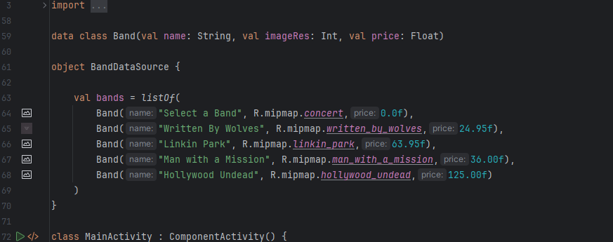

    >>**Notes on Kotlin Syntax:**
    >> - **data class**: A `data class` in Kotlin is used to hold data. It automatically provides several useful methods, such as `equals()`, `hashCode()`, `toString()`, and `copy()`, based on the properties defined in the class.
    >>
    >> - **object**: In Kotlin, the `object` keyword is used to declare a **singleton**, which means there will be only one instance of `BandDataSource` in the app.
    >>    - **Predefined Band List**: A list containing instances of the `Band` `data class`. Each instance has a name, an image resource ID, and a price.

- Go back to `BandSelection` Composable and we no modify the arguments and the body:

    ```kt
    @Composable
    fun BandSelection(selectedBand : Band, onBandSelected: (Band) -> Unit){
        var expanded by remember { mutableStateOf(false)}

        Row(
        modifier = Modifier.fillMaxWidth(),
            horizontalArrangement = Arrangement.Center
        ){
            Box(modifier = Modifier
                .background(Color(0XFFE3E3E1), RoundedCornerShape(8.dp))
                .padding(8.dp)
                .fillMaxWidth()
            ){
                TextButton(
                    onClick = { expanded = true },
                    modifier = Modifier.fillMaxWidth())
                {
                    Row(modifier = Modifier.fillMaxWidth())
                    {
                    
                    }
                }
            }
        }
    }
    ```

    >> **Notes on Composables etc:**
    >> - **remember**: `remember` is a composable function that allows a state to be remembered across recompositions
    >>
    >> - **mutableStateOf**: `mutableStateOf` is used to create a state variable that can be observed for changes.
    >> 
    >> - Putting both together, they are used to hold and manage state in Jetpack Compose.
    >> 
    >> - **Box**: A layout composable that places its children on top of each other (like a stack) with the first child on the bottom
    >>
    >> - **TextButton**: A button composable that displays text. It is used for simple text-based buttons without background or elevation
    >>
    >> - **onBandSelection**: A lambda function that takes a `Band` as a parameter and returns `Unit`. This function is called when a new band is selected, allowing the parent composable to update the selected band.
    >>
    >> - **Unit**: is a type that corresponds to `void` in other programming languages. It is used to indicate that a function does not return any meaningful value. When a function returns `Unit`, it means that the function's purpose is to perform some action rather than produce a result.

    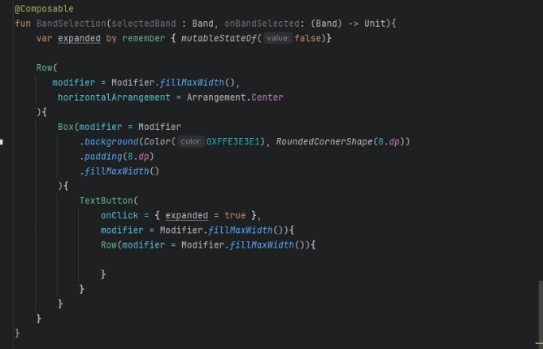

-  Go back to the top of the `ConcertTicketApp` and add a new remember initialisation so that when a band is selected and the recompostion is invoked the band selected is stored presistently across recompositions.

    ```kt

    @OptIn(ExperimentalMaterial3Api::class)
    @Composable
    fun ConcertTicketApp(){
        var selectedBand by remember { mutableStateOf(BandDataSource.bands[0]) }
        ...
    }
    ```
    >> **Notes:**
    >> - **mutableStateOf(BandDataSource.bands[0])**: Initially, when the app loads the `selectedBand` stores the the first element in the `BandDataSource`, everytime a new selection is made the `selectedBand` will store the current selected index

- Update the Surface too, so that we can preview the `BandSelection`

    ```kt
    ...
    Surface(modifier = Modifier.padding(innerPadding)) {
    Column(modifier = Modifier.fillMaxSize()) {
        BandSelection(selectedBand = selectedBand) {selectedBand = it }
    ...

    ```

    >> **Notes:**
    >> - Lambda Function `{selectedBand = it}`: The lambda function takes a band (`it`) as a parameter and assigns it to the `selectedBand` variable. This updates the state with the newly selected band.

    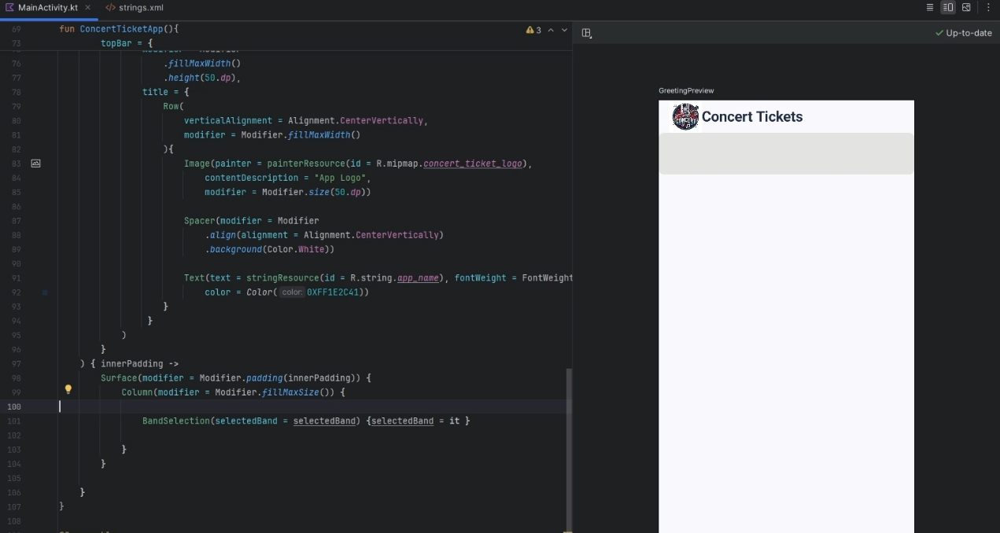


-  Continue modifying the `BandSelection` composable `Row` so:

    ```kt
    ...
    Row(modifier = Modifier.fillMaxWidth())
    {
        Text(
            text = selectedBand.name,
            color = Color(0XFF1E2C41),
            fontSize = 25.sp)
        Icon(imageVector = ImageVector
            .vectorResource(id = R.drawable.ic_baseline_arrow_drop_down),
            contentDescription = "Dropdown Arrow",
            tint = Color.Black)
    }
    ...
    ```

    - You need to create the `ic_baseline_arrow_drop_down` assest, copy the code in the collaspable field below and create a new image resource :

        <details>
        <summary> ic_baseline_arrow_drop_down xml code</summary>

        ```xml
        <vector xmlns:android="http://schemas.android.com/apk/res/android" android:height="24dp" android:viewportHeight="24" android:viewportWidth="24" android:width="24dp">

        <path android:fillColor="#000000" android:fillType="evenOdd" android:pathData="M12.707,14.707C12.317,15.098 11.683,15.098 11.293,14.707L6.293,9.707C5.902,9.317 5.902,8.683 6.293,8.293C6.683,7.902 7.317,7.902 7.707,8.293L12,12.586L16.293,8.293C16.683,7.902 17.317,7.902 17.707,8.293C18.098,8.683 18.098,9.317 17.707,9.707L12.707,14.707Z"/>

        </vector>
        ```

        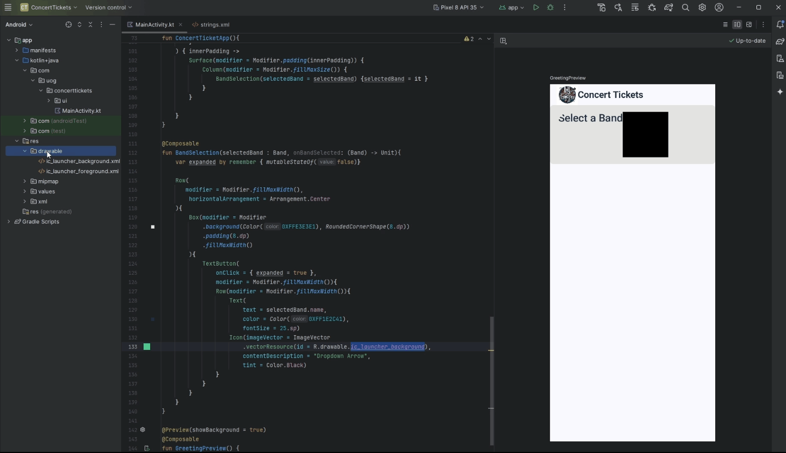

        </details>

    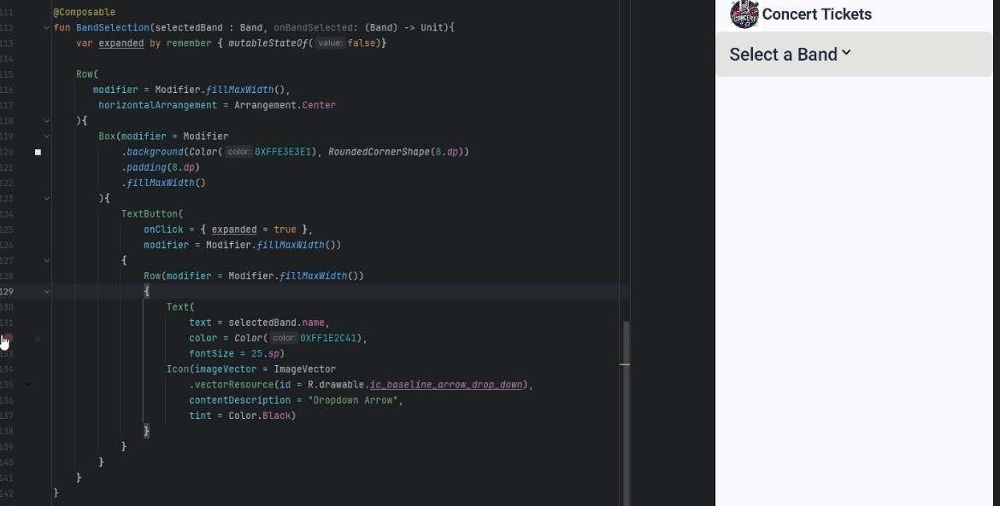

-  Following on we need to add the `DropDownMenuItem`'s so that the `DropDownMenu` can display each `Band` name from the dropdown list:

    ```kt
    ...
    DropdownMenu(
                expanded = expanded,
                onDismissRequest = { expanded = false },
                modifier = Modifier
                    .background(Color(0XFFE3E3E6))
                    .width(400.dp)) {
                BandDataSource.bands.forEach { band ->
                    DropdownMenuItem(text = {
                        Text(
                            text = band.name,
                            color = Color(0XFF1E2C41),
                            fontSize = 25.sp)
                    }, onClick = {
                        onBandSelected(band)
                        expanded = false})
                }
            }
    ...
    ```

    >**Note:**
    >> - This block dynamically creates a list of dropdown menu items for each band.#
    >>    - Each item's text is the band's name, styled with a specific color and font size.
    >>    - Clicking an item triggers a selection function and closes the dropdown menu.
    >> 
    >> - **BandDataSource.bands.forEach { band ->**: this line iterates through a list of bands provided by `BandDataSource.bands`, for each band in the list, the code inside the `forEach` block is executed.
    >>
    >> - **DropdownMenuItem**: Menus display a list of choices on a temporary surface. They appear when users interact with a button, action, or other control.

    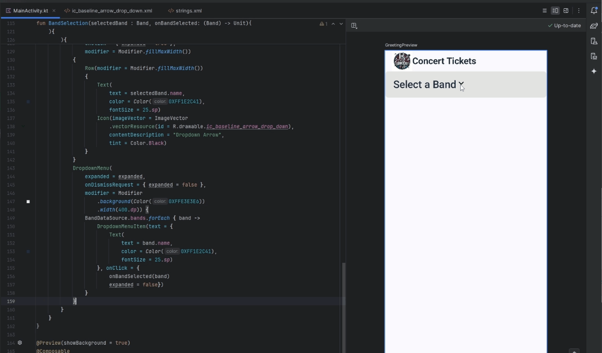


## BandSelection, Band Image

### Video @ 44.10 - 46.35

- Go  back up to the `Surface` where we invoke our `BandSelection(...){...}`, and reproduce the new lines below, several comments and a new function call `BandImage(selectedBand)` below:

    ```kt
    ...

    innerPadding ->
    Surface(modifier = Modifier.padding(innerPadding)) {
        Column(modifier = Modifier.fillMaxSize()) {
            BandSelection(selectedBand = selectedBand) {selectedBand = it }
            //Text FOR TICKET COST
            //Calcuate the cost
            // Display the cost
            // display Band image
            BandImage(selectedBand)
        }
    }
    ...
    ```

- Navigate to the end of the file and create a new composable function called `BandImage()`, like below:

    ```kt
    @Composable
    fun BandImage(selectedBand: Band) {
        Image(
            painter = painterResource(id = selectedBand.imageRes),
            contentDescription = null,
            contentScale = ContentScale.Fit,
            alignment = Alignment.Center,
            modifier = Modifier
                .fillMaxWidth()
                .height(300.dp))
    }
    ```
    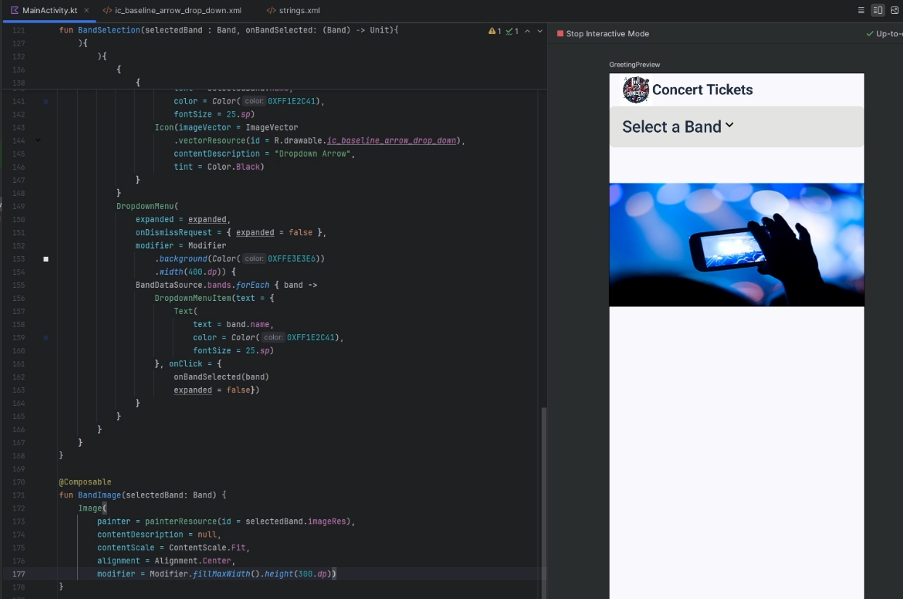

## BandSelection, TicketCost

### Video @ 46.35 - 51.25

- Go  back up to the `Surface` where we invoke our `BandSelection(...){...}`, and reproduce the new lines below, several comments and a new function call `TicketInput(ticketCost)` below:

    ```kt
    innerPadding ->
            Surface(modifier = Modifier.padding(innerPadding)) {
                Column(modifier = Modifier.fillMaxSize()) {
                    BandSelection(selectedBand = selectedBand) {selectedBand = it }
                    //Text FOR TICKET COST
                    TicketInput(ticketCount){ticketCount = it}
                    //Calcuate the cost
                    // Display the cost
                    // display Band image
                    BandImage(selectedBand)
                }
            }
    ```

-  Go back to the top of the `ConcertTicketApp` and add a new remember initialisation so that when you use the input field and it recomposes each time the userinput is presistent,called `ticketCount`.

    ```kt

    @OptIn(ExperimentalMaterial3Api::class)
    @Composable
    fun ConcertTicketApp(){
        var selectedBand by remember { mutableStateOf(BandDataSource.bands[0]) }
        var ticketCount by remember { mutableStateOf("") }  
        ...
    }
    ```
    >> **Notes:**
    >> - ** mutableStateOf("")**: Initially, when the app loads the `TextInput` composable, the field is empty. Then when a user enters a character the value is stored across recompositions.

- Navigate to the `BandImage(...)` function and above the declaration add the new function `TextInput()`:

    ```kt
    @Composable
    fun TicketInput(ticketCount: String, onTicketCountChange: (String) -> Unit){
        TextField(value = ticketCount, onValueChange = onTicketCountChange,
            label = { Text(text = "Number of Tickets")},
            keyboardOptions = KeyboardOptions(keyboardType = KeyboardType.Number),
            modifier = Modifier.fillMaxWidth()
        )
    }
    ```

## BandSelection, CalculateCostButton

### Video @ 51.25 - 1:03:17

- Navigate back to `Surface` and update the code to create some spacing between `Composable`'s, a new function call `CalcualteCostButton` and create a new `remember` type called `totalCost`:

    ```kt
    innerPadding ->
        Surface(modifier = Modifier.padding(innerPadding)) {
            Column(modifier = Modifier.fillMaxSize()) {
                BandSelection(selectedBand = selectedBand) {selectedBand = it }
                Spacer(modifier = Modifier.height(32.dp))
                //Text FOR TICKET COST
                TicketInput(ticketCount){ticketCount = it}
                Spacer(modifier = Modifier.height(42.dp))
                //Calcuate the cost
                CalculateCostButton(selectedBand,ticketCount){totalCost = it}
                Spacer(modifier = Modifier.height(42.dp))
                // Display the cost
                // display Band image
                BandImage(selectedBand)
            }
        }
    ```
    - `totalCost` `remember` type:
    
        ```kt
        
        @OptIn(ExperimentalMaterial3Api::class)
        @Composable
        fun ConcertTicketApp(){
            var selectedBand by remember { mutableStateOf(BandDataSource.bands[0]) }
            var ticketCount by remember { mutableStateOf("") }
            var totalCost by remember { mutableStateOf("") }
            ...
        ```

        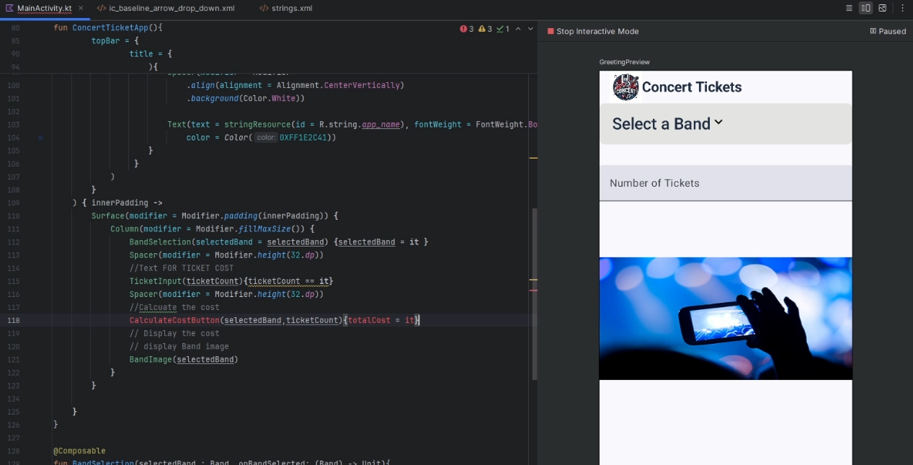

- Navigate to the `TextInput()` `Composable`, and declare the newly referenced function `CalculateCostButton`:

    ```kt
    @Composable
    fun CalculateCostButton(selectedBand: Band,ticketCount: String,onCalculate: (String) -> Unit){
        val costPerTicket = selectedBand.price
        val format: NumberFormat = NumberFormat.getCurrencyInstance().apply {
            currency = Currency.getInstance("GBP")
            maximumFractionDigits = 2
            minimumFractionDigits = 2
        }

    }
    ```

  >**Note:**
  >> - **NumberFormat**: used to format numbers as currency, specifically in this instance GBP (British Pounds). It sets up a `NumberFormat` instance that ensures all currency values have exactly two decimal places.

- Next in side the body of the function use the `Button` `Composable`: 

    ```kt
    Button(onClick = {
        val count = ticketCount.toIntOrNull() ?: 0
        if (selectedBand.name == "Select a Band"){
            onCalculate("Please Select a Band")
        }
        else if (count <= 0){
            onCalculate("Enter value greater than 0")
        }
        else{
            val total = costPerTicket * count
            onCalculate("Cost for ${selectedBand.name} is ${format.format(total)}")
        }

    },
        modifier = Modifier
            .fillMaxWidth()
            .height(65.dp),
        colors = ButtonDefaults.buttonColors(contentColor = Color(0XFF1E2C41))
        ) {
        Text(text = "Find Cost", fontSize = 20.sp, color = Color.White)

    }
    ```

    >**Notes:**
    >> - **val count = ticketCount.toIntOrNull() ?: 0**: `ticketCount.toIntOrNull()` attempts to convert the `ticketCount` string to an integer.
    >>    - If the conversion fails (i.e., `ticketCount` is not a valid integer), `toIntOrNull()` returns `null`, and the **Elvis** operator (`?:`) assigns `0` to `count`.
    >>    - This ensures that count is always an integer, defaulting to `0` if the conversion fails
    >>
    >> - **onCalculate("Cost for ${selectedBand.name} is ${format.format(total)}")**:
    >>    - "`Cost for ${selectedBand.name} is ${format.format(total)}`": This is a string with interpolated expressions inside it. In Kotlin, string interpolation allows you to include variables or expressions within a string by enclosing them in `${}`
    >>
    >> - **${selectedBand.name}**: This expression accesses the name property of the `selectedBand` object and inserts its value into the string.
    >> - **${format.format(total)}**: This expression formats the total value as a currency string using the format object, which is an instance of `NumberFormat` configured for currency formatting.

    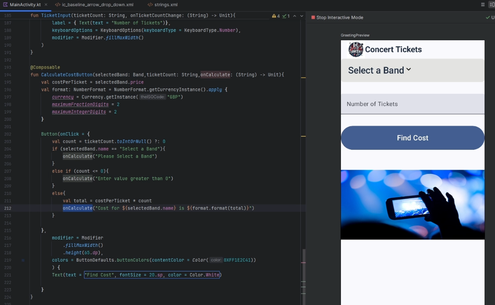


## BandSelection, CostDisplay

### Video @ 1:03:17 - 1:05:38

- - Navigate back to `Surface` and update the code to create some spacing between `Composable`'s, a new function call `CostDisplay`:

    ```kt
    innerPadding ->
            Surface(modifier = Modifier.padding(innerPadding)) {
                Column(modifier = Modifier.fillMaxSize()) {
                    BandSelection(selectedBand = selectedBand) {selectedBand = it }
                    Spacer(modifier = Modifier.height(32.dp))
                    //Text FOR TICKET COST
                    TicketInput(ticketCount){ticketCount = it}
                    Spacer(modifier = Modifier.height(42.dp))
                    //Calcuate the cost
                    CalculateCostButton(selectedBand,ticketCount){totalCost = it}
                    Spacer(modifier = Modifier.height(42.dp))
                    // Display the cost
                    CostDisplay(totalCost)
                    Spacer(modifier = Modifier.height(42.dp))
                    // display Band image
                    BandImage(selectedBand)
                }
            }
    ```

- Navigate to the `BandImage()` `Composable`, and declare the newly referenced function `CostDisplay`:

    ```kt
    @Composable
    fun CostDisplay(totalCost : String){
    Text(
        text = totalCost,
        fontSize = 20.sp,
        color = Color.Black,
        modifier =  Modifier.fillMaxWidth(),
        textAlign = TextAlign.Center)

    }
    ```

    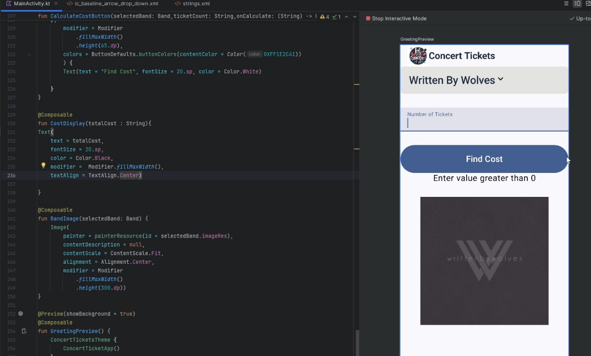


-----


<table>
<tr>
<td style="width: 50%; padding: 10px; border: 0px solid #ddd;">

If you run the app you should now be able to reproduce the following: 

</td>
<td style="width: 50%; padding: 10px; border: 0px solid #ddd;">


</td>
</tr>
</table>

-----------

<details>

<summary>The whole program should look like this: </summary>

```kt
package com.uog.concerttickets

import android.icu.text.NumberFormat
import android.icu.util.Currency
import android.os.Bundle
import androidx.activity.ComponentActivity
import androidx.activity.compose.setContent
import androidx.activity.enableEdgeToEdge
import androidx.collection.mutableObjectIntMapOf
import androidx.compose.foundation.Image
import androidx.compose.foundation.background
import androidx.compose.foundation.layout.Arrangement
import androidx.compose.foundation.layout.Box
import androidx.compose.foundation.layout.Column
import androidx.compose.foundation.layout.Row
import androidx.compose.foundation.layout.Spacer
import androidx.compose.foundation.layout.fillMaxSize
import androidx.compose.foundation.layout.fillMaxWidth
import androidx.compose.foundation.layout.height
import androidx.compose.foundation.layout.padding
import androidx.compose.foundation.layout.size
import androidx.compose.foundation.layout.width
import androidx.compose.foundation.shape.RoundedCornerShape
import androidx.compose.foundation.text.KeyboardOptions
import androidx.compose.material3.Button
import androidx.compose.material3.ButtonDefaults
import androidx.compose.material3.DropdownMenu
import androidx.compose.material3.DropdownMenuItem
import androidx.compose.material3.ExperimentalMaterial3Api
import androidx.compose.material3.Icon
import androidx.compose.material3.Scaffold
import androidx.compose.material3.Surface
import androidx.compose.material3.Text
import androidx.compose.material3.TextButton
import androidx.compose.material3.TextField
import androidx.compose.material3.TopAppBar
import androidx.compose.runtime.Composable
import androidx.compose.runtime.currentComposer
import androidx.compose.runtime.getValue
import androidx.compose.runtime.mutableStateOf
import androidx.compose.runtime.remember
import androidx.compose.runtime.setValue
import androidx.compose.ui.Alignment
import androidx.compose.ui.Modifier
import androidx.compose.ui.graphics.Color
import androidx.compose.ui.graphics.vector.ImageVector
import androidx.compose.ui.layout.ContentScale
import androidx.compose.ui.res.painterResource
import androidx.compose.ui.res.stringResource
import androidx.compose.ui.res.vectorResource
import androidx.compose.ui.text.font.FontWeight
import androidx.compose.ui.text.input.KeyboardType
import androidx.compose.ui.text.style.TextAlign
import androidx.compose.ui.tooling.preview.Preview
import androidx.compose.ui.unit.dp
import androidx.compose.ui.unit.sp
import com.uog.concerttickets.ui.theme.ConcertTicketsTheme

data class Band(val name: String, val imageRes: Int, val price: Float)

object BandDataSource {

    val bands = listOf(
        Band("Select a Band", R.mipmap.concert,0.0f),
        Band("Written By Wolves", R.mipmap.written_by_wolves,24.95f),
        Band("Linkin Park", R.mipmap.linkin_park,63.95f),
        Band("Man with a Mission", R.mipmap.man_with_a_mission,36.00f),
        Band("Hollywood Undead", R.mipmap.hollywood_undead,125.00f)
    )
}

class MainActivity : ComponentActivity() {
    override fun onCreate(savedInstanceState: Bundle?) {
        super.onCreate(savedInstanceState)
        enableEdgeToEdge()
        setContent {
            ConcertTicketsTheme {
               ConcertTicketApp()
            }
        }
    }
}

@OptIn(ExperimentalMaterial3Api::class)
@Composable
fun ConcertTicketApp(){
    var selectedBand by remember { mutableStateOf(BandDataSource.bands[0]) }
    var ticketCount by remember { mutableStateOf("") }
    var totalCost by remember { mutableStateOf("") }

    Scaffold(
        topBar = {
            TopAppBar(
                modifier = Modifier
                    .fillMaxWidth()
                    .height(50.dp),
                title = {
                    Row(
                        verticalAlignment = Alignment.CenterVertically,
                        modifier = Modifier.fillMaxWidth()
                    ){
                        Image(painter = painterResource(id = R.mipmap.concert_ticket_logo),
                            contentDescription = "App Logo",
                            modifier = Modifier.size(50.dp))

                        Spacer(modifier = Modifier
                            .align(alignment = Alignment.CenterVertically)
                            .background(Color.White))

                        Text(text = stringResource(id = R.string.app_name), fontWeight = FontWeight.Bold,
                            color = Color(0XFF1E2C41))
                    }
                 }
            )
        }
    ) { innerPadding ->
        Surface(modifier = Modifier.padding(innerPadding)) {
            Column(modifier = Modifier.fillMaxSize()) {
                BandSelection(selectedBand = selectedBand) {selectedBand = it }
                Spacer(modifier = Modifier.height(32.dp))
                //Text FOR TICKET COST
                TicketInput(ticketCount){ticketCount = it}
                Spacer(modifier = Modifier.height(42.dp))
                //Calcuate the cost
                CalculateCostButton(selectedBand,ticketCount){totalCost = it}
                Spacer(modifier = Modifier.height(42.dp))
                // Display the cost
                CostDisplay(totalCost)
                Spacer(modifier = Modifier.height(42.dp))
                // display Band image
                BandImage(selectedBand)
            }
        }

    }
}

@Composable
fun BandSelection(selectedBand : Band, onBandSelected: (Band) -> Unit){
    var expanded by remember { mutableStateOf(false)}

    Row(
       modifier = Modifier.fillMaxWidth(),
        horizontalArrangement = Arrangement.Center
    ){
        Box(modifier = Modifier
            .background(Color(0XFFE3E3E1), RoundedCornerShape(8.dp))
            .padding(8.dp)
            .fillMaxWidth()
        ){
            TextButton(
                onClick = { expanded = true },
                modifier = Modifier.fillMaxWidth())
            {
                Row(modifier = Modifier.fillMaxWidth())
                {
                    Text(
                        text = selectedBand.name,
                        color = Color(0XFF1E2C41),
                        fontSize = 25.sp)
                    Icon(imageVector = ImageVector
                        .vectorResource(id = R.drawable.ic_baseline_arrow_drop_down),
                        contentDescription = "Dropdown Arrow",
                        tint = Color.Black)
                }
            }
            DropdownMenu(
                expanded = expanded,
                onDismissRequest = { expanded = false },
                modifier = Modifier
                    .background(Color(0XFFE3E3E6))
                    .width(400.dp)) {
                BandDataSource.bands.forEach { band ->
                    DropdownMenuItem(text = {
                        Text(
                            text = band.name,
                            color = Color(0XFF1E2C41),
                            fontSize = 25.sp)
                    }, onClick = {
                        onBandSelected(band)
                        expanded = false})
                }
            }
        }
    }
}

@Composable
fun TicketInput(ticketCount: String, onTicketCountChange: (String) -> Unit){
    TextField(value = ticketCount, onValueChange = onTicketCountChange,
        label = { Text(text = "Number of Tickets")},
        keyboardOptions = KeyboardOptions(keyboardType = KeyboardType.Number),
        modifier = Modifier.fillMaxWidth()
    )
}

@Composable
fun CalculateCostButton(selectedBand: Band,ticketCount: String,onCalculate: (String) -> Unit){
    val costPerTicket = selectedBand.price
    val format: NumberFormat = NumberFormat.getCurrencyInstance().apply {
        currency = Currency.getInstance("GBP")
        maximumFractionDigits = 2
        minimumFractionDigits = 2
    }

    Button(onClick = {
        val count = ticketCount.toIntOrNull() ?: 0
        if (selectedBand.name == "Select a Band"){
            onCalculate("Please Select a Band")
        }
        else if (count <= 0){
            onCalculate("Enter value greater than 0")
        }
        else{
            val total = costPerTicket * count
            onCalculate("Cost for ${selectedBand.name} is ${format.format(total)}")
        }

    },
        modifier = Modifier
            .fillMaxWidth()
            .height(65.dp),
        colors = ButtonDefaults.buttonColors(contentColor = Color(0XFF1E2C41))
        ) {
        Text(text = "Find Cost", fontSize = 20.sp, color = Color.White)

    }
}

@Composable
fun CostDisplay(totalCost : String){
Text(
    text = totalCost,
    fontSize = 20.sp,
    color = Color.Black,
    modifier =  Modifier.fillMaxWidth(),
    textAlign = TextAlign.Center)

}

@Composable
fun BandImage(selectedBand: Band) {
    Image(
        painter = painterResource(id = selectedBand.imageRes),
        contentDescription = null,
        contentScale = ContentScale.Fit,
        alignment = Alignment.Center,
        modifier = Modifier
            .fillMaxWidth()
            .height(300.dp))
}

@Preview(showBackground = true)
@Composable
fun GreetingPreview() {
    ConcertTicketsTheme {
        ConcertTicketApp()
    }
}
```
</details>

-------------

## Continue Here...


> You will need to download the following picture folder -> [Lab_4-2_Picture.zip](Lab_4-2_Pictures.zip)

For the exercises below, follow the steps in the Ticket Vault example (above).

## 1. Catalina Island Boat Express App

|Application Title|Catalina Island Boat Express App|
|---|---|
|Purpose|Catalina Express has 30 daily departures between Long Beach and Catalina Island. Create a simple app that determines how many boat tickets the user needs and whether the ticket is for going to Catalina Island or heading back to Long Beach. The app displays the total price for the fare in one direction|
|Algorithm 1:|The app displays a title; an image (provided in the Pictures folder at top of workbook), and a Text Field, Spinner, and Button control. The two options in the Spinner control include To Catalina Island and To Long Beach. Each single passenger ticket is $34 for one way.
|Algorithm 2:|When the user taps or clicks the Button control, the number of tickets and the total cost of the fare is displayed|
|Alogrithm 3:|Use a black theme, Spinner prompt, string array, and a hint property.|

<div align=center>


</div>

---------

## 2. Triathlon Registration App

|Application Title|Triathlon Registration App|
|---|---|
|Purpose|A triathlon registration app allows an athlete to register for one of three national triathlons to qualify for the Ironman World Championship|
|Algorithm 1:|The triathlon registration app has two Text Fields: one requests the number of athletes on the user’s team and the other requests the location. A Spinner control allows the athlete to select one of three possible locations: Lake Placid, Big Island Hawaii, and Miami. The app also displays a title, an image (called triathlon.png in the Pictures folder you downloaded) and a Button control.|
|Algorithm 2:|After the user clicks the Button control, the selected location and the total team coast are displayed in the TextView control.|
|Algorithm 3:|Use a theme, a title, an image, a Spinner prompt, a string array, and a hint property|


<div align=center>


</div>

-----

## 3. Medway Cab Fare App

|Application Title|Medway Cab Fare App|
|---|---|
|Purpose|Create an app that estimates the cost for cab fare in Medway. The app calculates the cost of the trip and request a reservation for a smart car, traditional sedan or a minivan|
|Algorithm 1:|The app requests the distance in miles for the cab ride and your preference for the requested cab: a smart car, traditional sedan or a minivan.  The cab fare has an initial fee of £3.00. The mileage rate of £3.50 is also charged.|
|Algorithm 2:|The app displays the name of a cab company (do your own research what kind of cab companies are available in Medway and choose one), a picture of a logo, and the results of the requested type of cab with the cost of the fare. Create your own layout.|
|Algorithm 3:|Use a theme, Spinner prompt, string array, and hint property.  Decimal mileage is possible.|

------


## 4. Split the Bill App

|Application Title|Split the Bill App|
|---|---|
|Purpose|You are out with friends at a nice restaurant.  This app splits the bill, including the tip, among the members of your party.|
|Algorithm 1:|A welcome screen displays the title, image, and button that displays a second screen when clicked. The input/output screen requests the restaurant bill and the number of people in your group. The Spinner control asks about the quality of service: Excellent, Average or Poor.|
|Algorithm 2:|Calculate a 15% tip and divide the restaurant bill with the tip included among the members of your party. Display the tip amount and the individual share of the bill.|
|Algorithm 3:|Use a theme, Spinner prompt, string array, and hint property.|