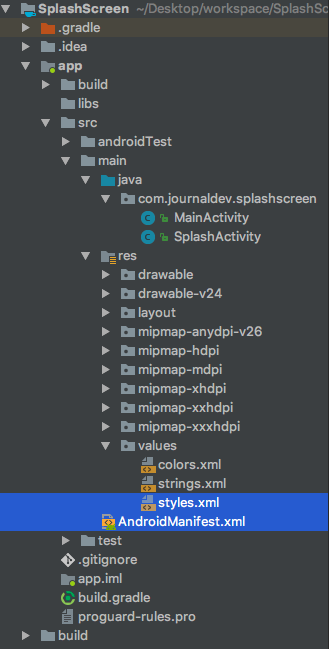
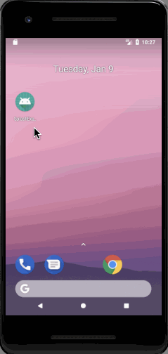
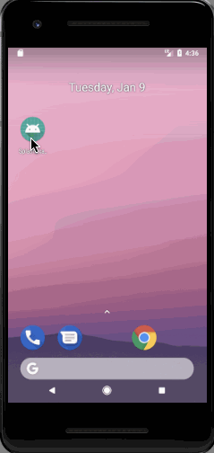

# Lab 15: Splash Screens

## Introduction 

Android Splash Screen is the first screen visible to the user when the application’s launched. Splash screen is one of the most vital screens in the application since it’s the user’s first experience with the application. Splash screens are used to display some animations (typically of the application logo) and illustrations while some data for the next screens are fetched.

Typically, the Activity that has the following intent filter set in the `AndroidManifest.xml` file is the Splash Activity.

```xml
<intent-filter>
            <action android:name="android.intent.action.MAIN" />
            <category android:name="android.intent.category.LAUNCHER" />
</intent-filter>
```

## Android Splash Screen Example Project Structure

<div align=center>



</div>

There are few ways to create the initial screen i.e. Splash Screen of the application. Let’s see each of them.

----------- 

## Task 1: Classical Approach

> Remember to open a new project in Android studio and call it `splashscreen`.


- Don't modify the `MainActivity.java` file.
- Modify the `AndroidMainfest.xml` 
  - to launch Splash screen

```xml
<?xml version="1.0" encoding="utf-8"?>
<manifest xmlns:android="http://schemas.android.com/apk/res/android"
    package="com.journaldev.splashscreen">

    <application
        android:allowBackup="true"
        android:icon="@mipmap/ic_launcher"
        android:label="@string/app_name"
        android:roundIcon="@mipmap/ic_launcher_round"
        android:supportsRtl="true"
        android:theme="@style/AppTheme">
        <activity android:name=".SplashActivity"
            android:theme="@style/SplashTheme">
            <intent-filter>
                <action android:name="android.intent.action.MAIN" />
                <category android:name="android.intent.category.LAUNCHER" />
            </intent-filter>
        </activity>
        <activity android:name=".MainActivity"/>
    </application>

</manifest>
```

- Create a `SplashActivity.java` file and modify the content as such:

```java
package com.example.splashscreen;

import android.content.Intent;
import android.os.Handler;
import android.support.v7.app.AppCompatActivity;
import android.os.Bundle;

public class SplashActivity extends AppCompatActivity {

    @Override
    protected void onCreate(Bundle savedInstanceState) {
        super.onCreate(savedInstanceState);
        setContentView(R.layout.activity_splash);

        new Handler().postDelayed(new Runnable() {


            @Override
            public void run() {
                // This method will be executed once the timer is over
                Intent i = new Intent(SplashActivity.this, MainActivity.class);
                startActivity(i);
                finish(); // explore the class Intent.
            }
        }, 5000); // Number is in milliseconds.
    }
}
```

- Create an `activity_splash.xml` in the `res/layout` folder

```xml
<?xml version="1.0" encoding="utf-8"?>
<android.support.constraint.ConstraintLayout xmlns:android="https://schemas.android.com/apk/res/android"
    xmlns:app="https://schemas.android.com/apk/res-auto"
    xmlns:tools="https://schemas.android.com/tools"
    android:layout_width="match_parent"
    android:layout_height="match_parent"
    android:background="@android:color/black"
    tools:context="com.example.splashscreen.SplashActivity">

    <ImageView
        android:id="@+id/imageView"
        android:layout_width="72dp"
        android:layout_height="72dp"
        android:src="@mipmap/ic_launcher"
        app:layout_constraintBottom_toBottomOf="parent"
        app:layout_constraintLeft_toLeftOf="parent"
        app:layout_constraintRight_toRightOf="parent"
        app:layout_constraintTop_toTopOf="parent" />


    <ProgressBar
        android:layout_width="wrap_content"
        android:layout_height="wrap_content"
        android:indeterminate="true"
        app:layout_constraintLeft_toLeftOf="parent"
        app:layout_constraintRight_toRightOf="parent"
        android:layout_marginTop="8dp"
        app:layout_constraintTop_toBottomOf="@id/imageView" />

</android.support.constraint.ConstraintLayout>
```

If you run this in the emulator, what happens?

<details>
<summary>Click to see</summary>

<div align=center>



</div>

Did you see the blank page that came up before the Splash Screen was visible to you? 

The above approach isn’t the correct approach. It’ll give rise to **cold** starts. 

The purpose of a Splash Screen is to quickly display a beautiful screen while the application fetches the relevant content if any (from network calls/database). With the above approach, there’s an additional overhead that the `SplashActivity` uses to create its layout. 

It’ll give rise to slow starts to the application which is bad for the user experience (wherein a blank black/white screen appears).


</details>

-------

## Task 2: Android Splash Screen Example with Correct Approach

The cold start appears since the application takes time to load the layout file of the `SplashActivity`. 

So instead of creating the layout, we’ll use the power of the application theme to create our initial layout. 

Application theme is instantiated before the layout is created. We’ll set a drawable inside the `android:windowBackground` attribute that’ll comprise of the Activity’s background and an icon using layer-list as shown below. `splash_background.xml`

```xml
<?xml version="1.0" encoding="utf-8"?>
<layer-list xmlns:android="https://schemas.android.com/apk/res/android">

    <item android:drawable="@android:color/black" />
    <item>
        <bitmap
            android:gravity="center"
            android:src="@mipmap/ic_launcher" />
    </item>
</layer-list>

```

Set the following style as the theme of the activity in `res/values/styles.xml`

```xml
<style name="SplashTheme" parent="Theme.AppCompat.NoActionBar">
        <item name="android:windowBackground">@drawable/splash_background</item>
    </style>
```

Modify the splash screen to look like this: 

```java
package com.journaldev.splashscreen;

import android.content.Intent;
import android.os.Handler;
import android.support.v7.app.AppCompatActivity;
import android.os.Bundle;

public class SplashActivity extends AppCompatActivity {

    @Override
    protected void onCreate(Bundle savedInstanceState) {
        super.onCreate(savedInstanceState);
        new Handler().postDelayed(new Runnable() {
            @Override
            public void run() {
                // This method will be executed once the timer is over
                Intent i = new Intent(SplashActivity.this, MainActivity.class);
                startActivity(i);
                finish();
            }
        }, 5000);
    }
}
```

Run and you should see the following output:

<div align=center>



</div>

> Note: the theme of the activity is set before anything else. Hence the above approach would give our app a quicker start.

Using the theme and removing the layout from the SplashActivity is the correct way to create a splash screen. 

**Now continue working on your assignment**