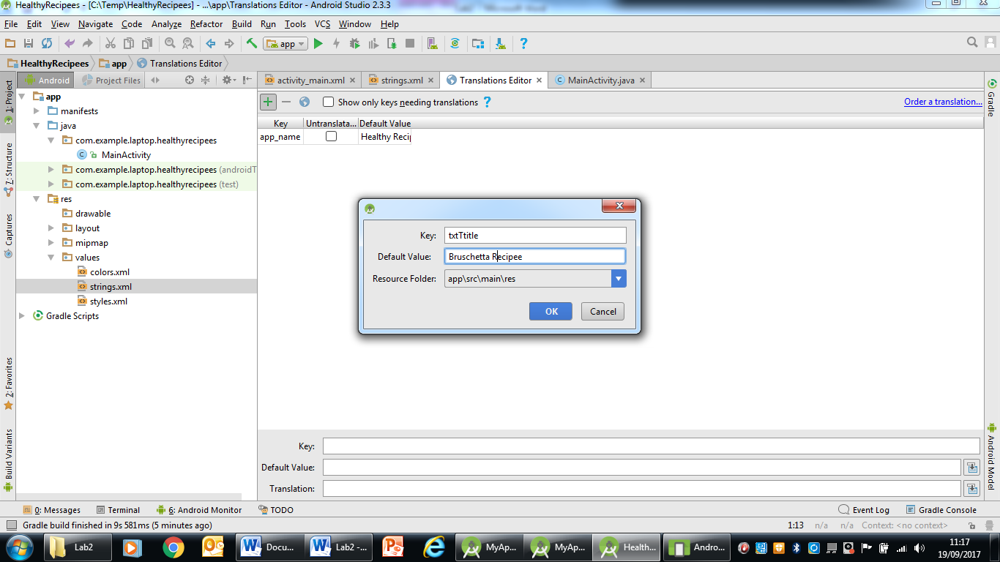
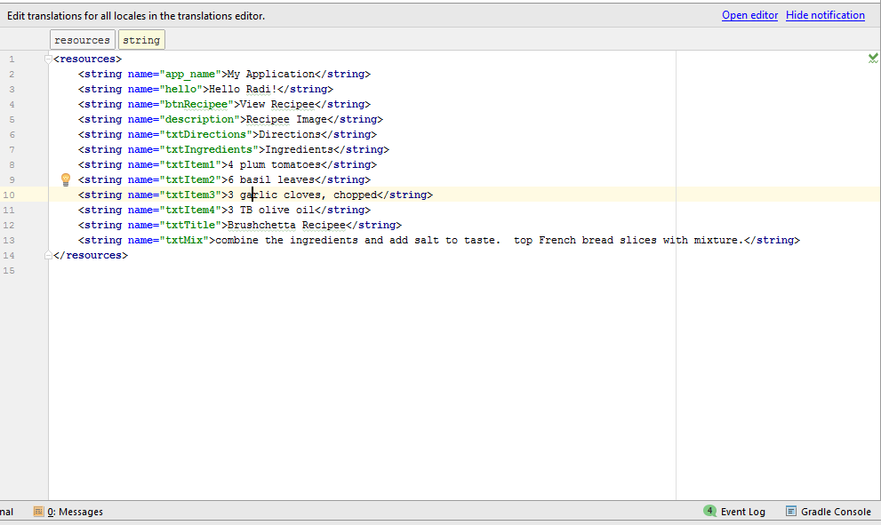

# Lab 2 Android User Interface. Part 1

Do the example from the lecture following the guidelines below.

## Using the Android User Interface
### Step 1

• Start a new project.  Open Android Studio.  Select File/New/New Project... from the main menu. 

• On the window that appears just click the Next button, making sure the Empty Activity is chosen (it is by default!).

### Step 2:
• After clicking the next button, the Create New Project dialog appears.

• In the Name: text box, type in Healthy Recipes. 7

• Choose the location where you want to save your projects or just use the default suggested location if =you are happy with it.

• Make sure the language chosen is Java and NOT Kotlin!

• If necessary, select API16: Android 4.1 (Jelly Bean) for the Minimum SDK as shown below:

### Step 3:
• Click the Finish button. 

• The Android project is now created and the `activity_main.xml` file and `MainActivity.java` file are visible as tabs. 

### Step 4:

• Click on the `activity_main.xml` tab.

• Click the Hello world! TextView widget (displayed by default) in the emulator and press the Delete key. 

## Using the String Table in the Transitions Editor

### Step 1:

• In the Android project view, expand the values folder within the res folder.

• Double-click the strings.xml file to display its default string resources

### Step 2:

• Click the Open editor link.

• Click the Add Key (+) button in the Translations Editor.

• In the Key text box, type `txtTitle` to name the string for the TextView control.

• In the Default Value text box, type `Bruschetta Recipe` to define the text to display.

### Step 3:

• Click the OK button.

• Click the Add key (~) button in the Translations Editor.

• In the Key text box, type btnRecipe to name the string for the Button control.

• In the Default Value text box, type View Recipe to define the text.

• Click the OK button.

• Click the Add key (+) button in the Translations Editor.

• In the Key text box, type description to name the string for the Button control.

• In the Default Value text box, type Recipe Image to define the text.
 
### Step 4:

• Click the OK button to add the string for the Button control to the String table, and then click the Add Key (plus sign) button in the Translations Editor.

• In the Key text box, type txtIngredients to name the string for a TextView control to display on the second app screen.

• In the Default Value text box, type Ingredients to define the text, and then click the OK button to add the string to the String table.

• Using the techniques taught in this step, add the strings in the table below to the String table in the Translations Editor:

|Key|Default Value|
|---|----|
|txtItem1| 4 plum tomatoes|
|txtItem2| 6 basil leaves|
|txtItem3| 3 garlic cloves, chopped|
|txtItem4| 3 TB olive oil |
|txtDirections| Directions|
|txtMix| Combine the ingredients and add salt to taste. Top French bread slices with mixture.|

## Android Text Properties

### Step 1:

• In the Common category in the Palette, select the widget named TextView and drag it near the top of the emulator.

• To centre the TextView control, drag it to the centre of the emulator until a dashed vertical line identifying the window’s centre is displayed.

### Step 2:

• Click on the TextView control on the emulator.

• Click on the vertical bar next to the text Property of the textView in the Attributes window.

• Choose txtTitle by clicking on it to choose it as an option and then click the OK button. Now the textView will change to Bruschetta Recipe as that is the value we have entered for txtTitle using the Translations Editor.

**Step 2:**

• Click on the textView and then right click and choose Center and then Horizontally from the drop down menu. 

• In the Attributes pane, choose the  and type in text. Find the textSize property from the list of text properties that appears.

• Click to the right of the textSize property, type `40sp`, and the press Enter.

• The result is shown below:

## Adding a File to the Resources Folder

**Step 1:**

• Copy the bruschetta.png file from the Pictures folder on the module moodle page to your PC or USB drive.

• To copy the bruschetta.png file, click the file on the PC or USB drive, then press Ctrl+C.

• To paste the image file into the drawable folder, right click the drawable folder in the Android project view.

• Click Paste on the shortcut menu.

