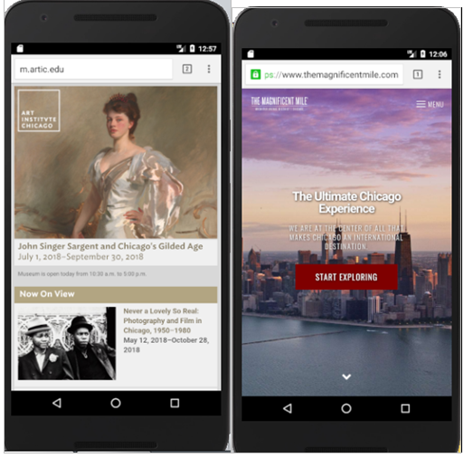
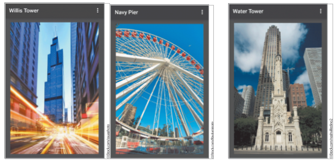
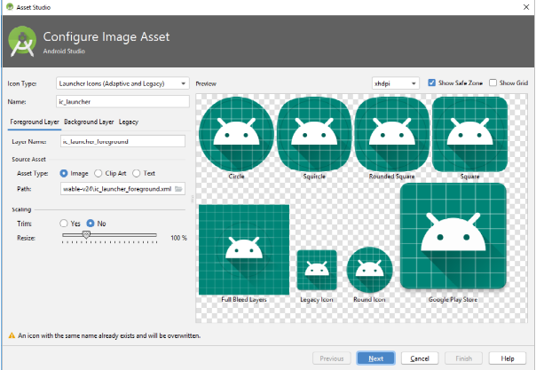
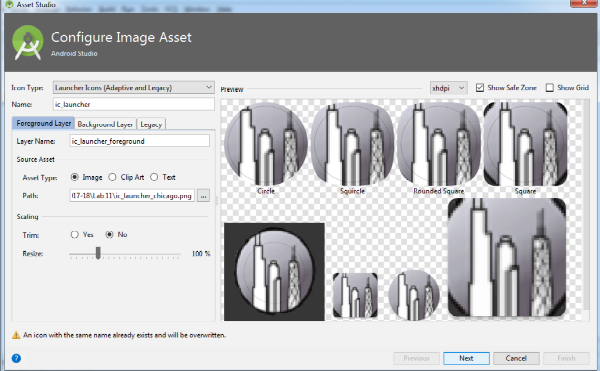
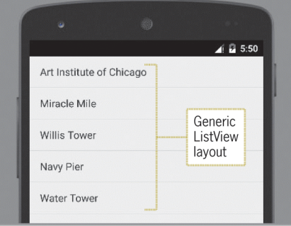
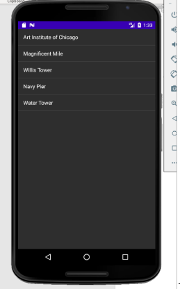
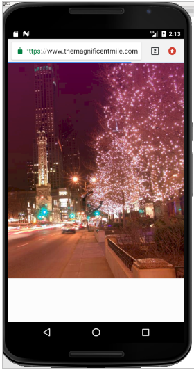
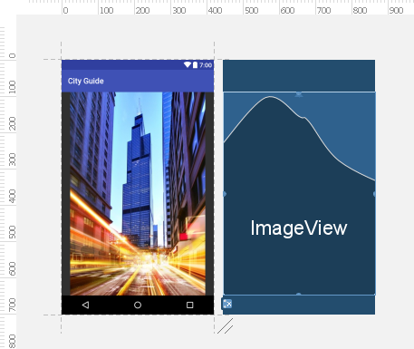

## Lab 8 Android Lists, Arrays and Web Browsers

You will be developing travel guide for Chicago app that highlights the best attractions the city has to offer.  The City Guide app opening screen is shown below:

> You will need to download the following picture folder -> [Lab_8_Picture.zip](Lab_8_Pictures.zip)

<div align=center>


</div>

The City Guide app displays 5 Chicago attractions. When the user taps one of the attractions, a second window opens displaying either an image or a web site providing more information about the site or activity.  The first two items on the list link to websites, as shown on the two figures below. A browser opens to display a web site for the Art Institute of Chicago or the Magnificent Mile.

<div align=center>



</div>

If the user selects Willis Tower, Navy Pier, or Water Tower, an image appears on a second screen as shown on the figures below.  By pressing the left hardware button on the emulator, you can return to the list of the attractions. 

<div align=center>



</div>

Complete the following steps to develop the app.
Creating a List by Extending a `ListActivity`

**Step 1:**
- Create a New Project with the name **City Guide** in the Application name text box. 
- Open `activity_main.xml`.
- Copy the `ic_launcher_chicago.png` file from the Pictures above.
- Click `File` on the menu bar and then click New to open the New menu.
- Click Image Asset on the New menu.  In the Asset Studio dialog window that appears, in Asset Type, click on the Image radio button.

<div align=center>



</div>

**Step 2:**
- In the Path: field click on the folder icon to the very end of the field and navigate to the location of `ic_launcher_chicago.png` file, and then select the file. 
- Click the Next button to add the custom launcher icon. 
- On the next dialog window, click the Finish button. The custom icons will be displayed in `res/mipmap` folder.

<div align=center>



</div>

**Step 3:**
- Click MainActivity.java tab and inside the Java file, click to the left of Activity in the `public class MainActivity extends AppCompatActivity {` and then change `AppCompatActivity` to `ListActivity`. (ListActivity is deprecated in API 30 so if you have this version, it will appear as `ListActivity`. Alternatively, depending on the API your Android Studio is running, `ListActivity` will appear in red. Press Alt + Enter to include the `ListActivity` class).

- Delete the line `setContentView(R.layout.activity_main);` because the layout will be custom coded later in the XML code window.

## Creating an Array of Attractions

**Step 1:**
- After the `super.onCreate(savedInstanceState);` statement in `MainActivity.java`, insert a new line.
  - Type `String[ ] attraction = {“Art Institute of Chicago”, “Magnificent Mile”, “Willis Tower”, “Navy Pier”, “Water Tower”};`
  - Save your work.

**Using a `setListAdapter` and `Array Adapter`**

**Step 1:**
- After the line of coding initialising the `String array`, press Enter. 
  - Type `setListAdapter(new ArrayAdapter<String>(this,	android.R.layout.simple_list_item_1, attraction));` and press Enter.  
  - Notice that `setListAdapter` is deprecated as well hence it is strikethrough. The `simple_list_item_1` is a reference to a built-in XML layout document that is part of the Android OS, rather than one of your own layouts.
  - Click the red `ArrayAdapter` text and `import ArrayAdapter` by pressing Alt+Enter. 7

**Step 2:**
- To display the attraction list in the generic `ListView` layout, click Run ‘app’ on the toolbar, and then select the emulator.  Click the OK button.
- When the app starts, it displays the `ListView` menu in the emulator. See the code below...


**Step 3:**
- To change the theme to a dark background, expand the `res\value` folder in the Android project view, and the double click `thymes.xml` (the first themes.xml file in themes (2) folder).
- Click to the right of `parent=”` and change the parent theme to `“Theme.AppCompat”` as shown in the figure below: 

```java
<resources xlms:tools="http://schemas.android.com/tools">
    <!-- Base application theme. -->
    <style name="Theme.CityLights" parent="Theme.AppCompat">
    ...
```

<div align=center>



</div>

- Close themes.xml and click the Save All button
- Run the app again, now the background has changed to black as the Theme have been changed, like shown below:

<div align=center>



</div>

**Adding Images to the drawable Folder**

There are three images that appear when the user selects the Willis Tower, Navy Pier and the Water Tower.  All the images are available in the Pictures folder downloaded in the zip.  Copy the files to the computer.  Copy also the `ic_launcher_chicago.png` icon. 

**Step 1:**
- To add the three images to the drawable resource folder, select the four files form wherever you copied them on your computer: `ic_launcher_chicago.png`, `s`, `water.png` and `willis.png`. 
- To paste the image files to the drawable folder, right click the drawable folder in the Android project view pane. And then click Paste.
- Click Save All to save your work.

**Adding the String Table**

**Step 1:**
- In the r`es\values folder`, double click the `strings.xml` file.
- Click the Open editor link in `strings.xml`.
- Click the Add key button (plus sign), type willis in the Key text box, and then type Willis Tower Image in the Default Value text box.  Click the Ok button.
- Click the Add key button again, type pier in the Key text box, and then type Navy Pier Image in the Default Value text box.  Click the Ok button.
- Click the Add key button again, type water in the Key text box, and then type Water Tower Image in the Default Value text box.  Click the Ok button.
- Save your work and close the Translations Editor and `strings.xml` tabs.

**Creating a Custom XML Layout for a ListView**

You can design a layout by using the emulator window on the design tab and then drag and drop controls from the Palette (this is what we have been doing with all the examples o far), or you can code the activity_main.xml file using the Text tab and manipulating the XML code directly. 

**Step 1:**
- Click the activity_main.xml tab.
- Click the Text tab at the bottom of the window to display the XML code. 
- Change the existing Constraint Layout to Relative Layout by highlighting the existing constraint layout as shown below:

```java
<?xml version="1.0" encoding="utf-8"?>
<androidx.constraintlayout.widget.ConstraintLayout xmlns:android="https://schemas.android.com/apk/res/android"
```

Start typing `R`, Relative Layout will appear as an option, make sure you choose it.  Now delete the `/` in the closing `/>` after `“.MainActivity”/>` and type below the closing tag `</RelativeLayout>`. The result is shown below:

```java
<?xml version="1.0" encoding="utf-8"?>
<RelavtiveLayout xmlns:android="https://schemas.android.com/apk/res/android"
...
</RelativeLayout>
```
- Click the line just above the closing statement `</RelativeLayout>`, and then press Enter.
- Type `<TextView` and press Enter.

**Step 2:**
- Type the following code using auto-completion as much as possible:
- 
```java
android:layout_width=”fill_parent”
android:layout_height=”wrap_content”
android:id=”@+id/travel”
android:textSize=”20sp”
android:text=”@+id/travel”
android:drawableLeft=”@drawable/ic_launcher_chicago” />

```

- The result is shown below,


```java
<?xml version="1.0" encoding="utf-8"?>
<RelavtiveLayout xmlns:android="https://schemas.android.com/apk/res/android"
    xmlns:app="https://schemas.android.com/apk/res/res-auto"
    xmlns:tools="https://schemas.android.com/tools"
    android:layout_width="match parent"
    android:layout_height="match parent"
    tools:context=".MainActivity">

    <TextView
        android:layout_width=”fill_parent”
        android:layout_height=”wrap_content”
        android:id=”@+id/travel”
        android:textSize=”20sp”
        android:text=”@+id/travel”
        android:drawableLeft=”@drawable/ic_launcher_chicago” />

</RelativeLayout>
```

**Coding a setListAdapter with a Custom XML Layout**

When the `setListAdapter` was coded earlier and executed as shown in the figure above, the attractions list was displayed within a build-in layout called `simple_list_item_1` in the following statement:

- `setListAdapter(new ArrayAdapter<String>(this, android.R.layout.simple_list_item_1, attraction));` 

Instead of using a standard layout in the `setListAdapter`, the custom XML layout you designed in `activity_main.xml` in the figure above adds the Chicago City Guide icon and updates the `TextView` properties.  The syntax changes from the default in two significant ways:

1. The second parameter in the default statement `(android.R.layout.simple_list_item_1)` is changed to `R.layout.activity_main`. The android reference is removed because the Android library default layout is not being used. Instead `R.layout.activity_main` references the `activity_main` custom layout design for the `TextView` control.

2. A third parameter is added before the attraction array to reference the variable travel, which identifies the `TextView` control created in the `activity_main.xml` file.  The variable name is substituted for the actual attraction names initialized in the attraction array. 
The following code syntax shows the code for a custom XML layout:

 - `setListAdapter(new ArrayAdapter<String>(this, R.layout.activity_main, R.id.travel, attraction);`

To edit the `setListAdapter` to use the custom XML layout, follow these steps:

**Step 1:**
- Close the `activity_main.xml` window.
- In the `setListAdapter` statement of the `MainActivity.java`, click after the comma following the this command.
- Change the `android.R.layout.simple_list_item_1` text to `R.layout.activity_main`, `R.id.travel` to add the custom layout named `activity_main.xml` before the comma and the attraction.  The result is shown below:

```java
public class MainActivity extends ListActivity {

    @override
    protected void onCreate(Bundle savedInstanceState){
        super.onCreate(savedInstanceState);
        String[5] attraction={"Art Institute of Chicago","Magnificent Mile","Willis Tower","Navy Pier","Water Tower"};
        setListAdapter(new ArrayAdapter<string>(this,R.layout.activity_main,R.id.travel, attraction));
    }
}

```
Step 2:
- Save and run the app to view the custom layout of the `ListView` as shown below:
  
<div align=center>


</div>

**Using the `onListItemClick` method**
In the City Guide opening screen each attraction displayed on the screen in the list in the figure above can be selected by tapping the attraction name on the mobile device.  The method `onListItemClick()` is called when an item in the list is selected.  When an attraction in the list is selected, the position of the item is passed from `onListItemClick`.  If the user selects the first attraction (Art Institute of Chicago), the position parameter is assigned an integer value of 0 (the array’s indexes in Java start from 0). The second item is assigned the position of 1, and so forth.

**Step 1:**

- In MainActivity.java, click after the closing brace `}` of the onCreate method to add a new line.
- To respond to the user selection, type:
   - `protected void onListItemClick(ListView l, View v, int position, long id)` to create an onListItemClick method to await the user selection from the `ListView` items. (Be sure to type the lower-case letter l after `ListView`, not the number 1!).
   - Type on opening `{` brace after the statement and then press Enter. A closing brace is automatically placed in the code. If `ListView` and View are red, then click on `ListView` and press Alt + Enter, do the same with `View`. 
   - The result is shown below:
  
```java
public class MainActivity extends ListActivity {

    @override
    protected void onCreate(Bundle savedInstanceState){
        super.onCreate(savedInstanceState);
        String[5] attraction={"Art Institute of Chicago","Magnificent Mile","Willis Tower","Navy Pier","Water Tower"};
        setListAdapter(new ArrayAdapter<string>(this,R.layout.activity_main,R.id.travel, attraction));
    }

    protected void onListItemClick(ListView l, View v, int position, long id){
    
    }
}
```

**Decision Structure – Switch Statement**

**Step 1:**
- On line 23, within the braces of the `onListItemClick` method, type `switch (position) {` and press Enter for the closing brace to appear.
- Within the braces of the switch statement, add the `case` integer options. Type the following code, inserting a blank line after each case statement:
```java
case 0:
	break;
case 1:
	break;
case 2:
	break;
case 3:
	break;
case 4:
	break;
```
The result looks like this:

```java
public class MainActivity extends ListActivity {

    @override
    protected void onCreate(Bundle savedInstanceState){
        super.onCreate(savedInstanceState);
        String[5] attraction={"Art Institute of Chicago","Magnificent Mile","Willis Tower","Navy Pier","Water Tower"};
        setListAdapter(new ArrayAdapter<string>(this,R.layout.activity_main,R.id.travel, attraction));
    }

    protected void onListItemClick(ListView l, View v, int position, long id){
       switch(position){
            case 0:
                break;
            case 1:
                break;
            case 2:
                break;
            case 3:
                break;
            case 4:
                break;
       }
    }
}
```

**Launching the Browser from an Android Device**

**Step 1:**
- In `MainActivity.java`, click the blank line after the line containing case 0: inside the switch decision structure.
- Type `startActivity(new Intent(Intent.ACTION_VIEW, Uri.parse(“http://artic.edu”)));`
- and case 1: type `startActivity(new Intent(Intent.ACTION_VIEW, Uri.parse(“http://themagnificentmile.com”)));`
- 
- Click Intent and press Alt+Enter, is necessary. Do the same with Uri.
The result is shown below:

```java
    protected void onListItemClick(ListView l, View v, int position, long id){
       switch(position){
            case 0:
                startActivity(new Intent(Intent.ACTION_VIEW, Uri.parse(“http://artic.edu”)));
                break;
            case 1:
                startActivity(new Intent(Intent.ACTION_VIEW, Uri.parse(“http://themagnificentmile.com”)));
                break;
            case 2:
                break;
            case 3:
                break;
            case 4:
                break;
       }
    }
}
```

**Step 2**

- To display the Art Institute of Chicago website in the browser run the app.
- Select the Art Institute of Chicago list item.

<div align=center>


</div>

- Now go back to the starting app screen by pressing the back button and select the Magnificent Mile from the list.  
  - The result is shown below:`startActivity(new Intent(Intent.ACTION_VIEW, Uri.parse(“http://artic.edu”)));`

<div align=center>



</div>

**Adding Multiple Class Files**

Multiple classes are needed to display images on the screen when the user selects Willis Tower, Navy Pier, or Water Tower on the opening `ListView` control.  Remember, each time you add a class to an application, the class must begin with a capital letter and a corresponding XML layout file with the same name with a lowercase letter is automatically created.  To create three class files and the coordinating XML layout files, follow these steps:

**Step 1:**
- In the Android project view, to create a second class, expand the java folder and press and hold or right-click the first java folder, point to `New` on the shortcut menu, and then click Activity. Next, click Empty Activity.
- Type Willis in the Activity Name text box to create a second class that will define the Willis Activity and a layout associated with the class named `activity_willis`.
- Close the `Willis.java` file tab.

**Step 2:**
- To create a third class, press and hold or right-click the first java folder, point to New on the shortcut menu, and then click Activity. Next, click Empty Activity.
- Type Pier in the Activity Name text box to create a third class that will define the Pier Activity.
- Close the `Pier.java` file tab,
- To create the fourth class, right-click the first java folder, point to New on the shortcut menu, and click Activity.  Next, click Empty Activity.
- Type Water in the Activity Name text box to create a fourth class that will define the Water Activity.
- Click the Finish button and save your work.
- Close the `Water.java` tab.

Three new Activity java files are created with three XML layout files in Android project view as shown below:

<div align=center>


</div>

**Designing XML Layout Files**

**Step 1:**
- Open the `activity_willis.xml` tab and click the Design tab at the bottom.
- In the Common category in the Palette, drag the `ImageView` control to the middle of the emulator (both horizontal and vertical dashed lines will appear).
- From the Pick a Resource dialog window that appears, choose willis image.
- Click the OK button to close the Pick a Resource dialog tab.
- Click the vertical bar to the right of the `contentDescription` property in the Properties pane.
- Select willis in the Pick a Resource dialog box and then click the OK button.
- The result is shown below:

<div align=center>



</div>

**Step 2:**
- Close the `activity_willis.xml` tab and save your work.
- Click the `activity_pier.xml` tab and click the Design tab to open the emulator window.
- In the Common category in the Palette, drag the ImageView control to the middle of the emulator (both horizontal and vertical dashed lines will appear).
- In the Pick a Resource dialog window, locate the pier image and then click pier.
- Click the OK button to close the Pick a Resource dialog box.
- Click the vertical bar to the right of the `contentDescription` property in the Properties pane.
- Select pier within the Pick a Resource dialog box and then click the OK button.
- The result is shown below:

<div align=center>


</div>

**Step 3:**
- Close the `activity_pier.xml` tab and save your work.
- Click the `activity_water.xml` tab and click the Design tab to open the emulator window.
- In the Images category in the Palette, drag the ImageView control to the middle of the emulator (both horizontal and vertical dashed lines will appear).
- In the Pick a Resource dialog window, locate the pier image and then click water.
- Click the OK button to close the Pick a Resource dialog box.
- Click the vertical bar to the right of the `contentDescription` property in the Properties pane.
- Select water within the Pick a Resource dialog box and then click the OK button.
- The result is shown below:

<div align=center>


</div>


**Opening the Class Files**

The last step in the development of the Chicago City Guide app is to launch the class files when the user selects Willis Tower (case 2), Navy Pier (case 3), or Water Tower (case 4) from the `ListView` control. 

**Step 1:**

- Close the activity_water.xml tab.
- In MainActivity.java, click the blank line below the statement case 2: and type:
    -   `startActivity(new Intent(MainActivity.this, Willis.class));`
- Click the blank line below the statement case 3: and type:
    - `startActivity(new Intent(MainActivity.this, Pier.class));`
- Click the blank line below the statement case 4: and type:
    - `startActivity(new Intent(MainActivity.this, Water.class));`

The result is shown below:

```java
public class MainActivity extends ListActivity {

    @override
    protected void onCreate(Bundle savedInstanceState){
        super.onCreate(savedInstanceState);
        String[5] attraction={"Art Institute of Chicago","Magnificent Mile","Willis Tower","Navy Pier","Water Tower"};
        setListAdapter(new ArrayAdapter<string>(this,R.layout.activity_main,R.id.travel, attraction));
    }

    protected void onListItemClick(ListView l, View v, int position, long id){
       switch(position){
            case 0:
                startActivity(new Intent(Intent.ACTION_VIEW, Uri.parse(“http://artic.edu”)));
                break;
            case 1:
                startActivity(new Intent(Intent.ACTION_VIEW, Uri.parse(“http://themagnificentmile.com”)));
                break;
            case 2:
                startActivity(new Intent(MainActivity.this, Willis.class));
                break;
            case 3:
                startActivity(new Intent(MainActivity.this, Pier.class));
                break;
            case 4:
                startActivity(new Intent(MainActivity.this, Water.class));
                break;
       }
    }
}
```

**Step 2:**
- Compare your code to the figure above, make changes as necessary to match the code in the figure and then save your work.
- Run the app and test every single option.
